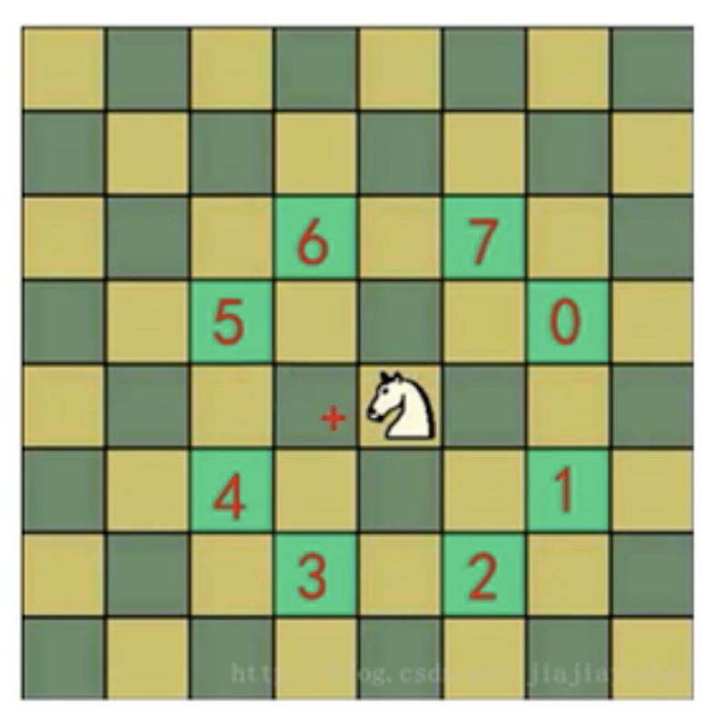

# 骑士周游问题

- ## 问题介绍

  将马随机放在国际象棋的`8*8`棋盘`Board[0-7][0-7]`的某个方格中，马按走棋规则(马走日字)进行移动，要求将每个方格只进入一次，走遍棋盘上全部64个方格。

  

- ## 解决步骤和思路

  1. 创建棋盘 chessboard，是一个二维数组;
  2. 将当前位置设置为已访问，然后根据当前位置，计算马儿还能走哪些位置，并放入到一个集合中，最多有8个位置，每走一步，就使用step+1；
  3. 遍历集合中存放的所有位置，看看哪个可以走通，如果走通就继续走，走不通就回溯；
  4. 判断马儿是否完成了任务，使用step和应该走的步数比较，如果没有达到，则将整个棋盘置0；

  **注意：**马儿不同的走法，会得到不同的结果，效率也会有影响（优化）。

- ## 代码案例

  ```java
  package com.xie.horse;
  
  import java.awt.*;
  import java.util.ArrayList;
  import java.util.Arrays;
  
  public class HorseChessBoard {
      //棋盘的列数
      private static int X = 8;
      //棋盘的行数
      private static int Y = 8;
  
      //标记各个位置是否被访问过
      private static boolean[] visited;
  
      //使用一个属性，标记是否棋盘所有位置都被访问，true表示成功
      private static boolean finished;
  
      public static void main(String[] args) {
          int row = 1;
          int col = 1;
          int[][] chessboard = new int[X][Y];
          visited = new boolean[X * Y];
          long start = System.currentTimeMillis();
          traversalChessboard(chessboard, row - 1, col - 1, 1);
          long end = System.currentTimeMillis();
          System.out.println("耗时：" + (end - start) + "ms");
  
          for (int i = 0; i < chessboard.length; i++) {
              System.out.println(Arrays.toString(chessboard[i]));
          }
  
          /**
           * 耗时：31043ms
           * [1, 8, 11, 16, 3, 18, 13, 64]
           * [10, 27, 2, 7, 12, 15, 4, 19]
           * [53, 24, 9, 28, 17, 6, 63, 14]
           * [26, 39, 52, 23, 62, 29, 20, 5]
           * [43, 54, 25, 38, 51, 22, 33, 30]
           * [40, 57, 42, 61, 32, 35, 48, 21]
           * [55, 44, 59, 50, 37, 46, 31, 34]
           * [58, 41, 56, 45, 60, 49, 36, 47]
           */
      }
  
      /**
       * 骑士周游问题算法
       *
       * @param chessboard 棋盘
       * @param row        当前位置第几行，从0开始
       * @param col        当前位置第几列，从0开始
       * @param step       第几步，初始从1开始
       */
      public static void traversalChessboard(int[][] chessboard, int row, int col, int step) {
          chessboard[row][col] = step;
          //标记该位置已访问
          visited[row * X + col] = true;
          //获取到当前位置可以走的下一个位置的集合
          ArrayList<Point> ps = next(new Point(col, row));
          while (!ps.isEmpty()) {
              Point p = ps.remove(0);
  
              //判断该点是否已经访问过,如果没有
              if (!visited[p.y * X + p.x]) {
                  traversalChessboard(chessboard, p.y, p.x, step + 1);
              }
          }
  
          //判断马儿是否完成了任务，使用step和应该走的步数比较，
          // 如果没有达到，则将整个棋盘置0；
          if (step < X * Y && !finished) {
              chessboard[row][col] = 0;
              visited[row * X + col] = false;
          } else {
              finished = true;
          }
      }
  
      /**
       * 根据当前的位置，计算马儿还能走哪些位置，并放入到一个集合中，最多有8个位
       *
       * @param curPoint
       * @return
       */
      public static ArrayList<Point> next(Point curPoint) {
          ArrayList<Point> ps = new ArrayList<>();
          Point p1 = new Point();
  
          //表示马儿可以走5位置
          if ((p1.x = curPoint.x - 2) >= 0 && (p1.y = curPoint.y - 1) >= 0) {
              ps.add(new Point(p1));
          }
  
          //表示马儿可以走6位置
          if ((p1.x = curPoint.x - 1) >= 0 && (p1.y = curPoint.y - 2) >= 0) {
              ps.add(new Point(p1));
          }
          //表示马儿可以走7位置
          if ((p1.x = curPoint.x + 1) < X && (p1.y = curPoint.y - 2) >= 0) {
              ps.add(new Point(p1));
          }
          //表示马儿可以走0位置
          if ((p1.x = curPoint.x + 2) < X && (p1.y = curPoint.y - 1) >= 0) {
              ps.add(new Point(p1));
          }
          //表示马儿可以走1位置
          if ((p1.x = curPoint.x + 2) < X && (p1.y = curPoint.y + 1) < Y) {
              ps.add(new Point(p1));
          }
          //表示马儿可以走2位置
          if ((p1.x = curPoint.x + 1) < X && (p1.y = curPoint.y + 2) < Y) {
              ps.add(new Point(p1));
          }
          //表示马儿可以走3位置
          if ((p1.x = curPoint.x - 1) >= 0 && (p1.y = curPoint.y + 2) < Y) {
              ps.add(new Point(p1));
          }
          //表示马儿可以走4位置
          if ((p1.x = curPoint.x - 2) >= 0 && (p1.y = curPoint.y + 1) < Y) {
              ps.add(new Point(p1));
          }
  
          return ps;
      }
  }
  
  ```

- ## 优化

  1. 骑士周游问题实际上是图的深度优先搜索（DFS)的应用；

  2. 如果使用回溯（就是深度优先搜索）来解决，假如马儿走了53个点，发现已经走到了尽头，那就只能回退，查看其它的路径，就在棋盘上不停的回溯；

  3. 使用贪心算法进行优化：

     - 获取当前位置，可以走的下一个位置的集合 ps;

     - 对 ps 中所有的 point 的下一步的所有集合的个数，进行非递减排序；

       **注意：** 9，7，5，4，3，2，1属于递减排序，1，2，2，2，3，3，3，10属于递减排序，

  ```java
  package com.xie.horse;
  
  import java.awt.*;
  import java.util.ArrayList;
  import java.util.Arrays;
  
  public class HorseChessBoard {
      //棋盘的列数
      private static int X = 8;
      //棋盘的行数
      private static int Y = 8;
  
      //标记各个位置是否被访问过
      private static boolean[] visited;
  
      //使用一个属性，标记是否棋盘所有位置都被访问，true表示成功
      private static boolean finished;
  
      public static void main(String[] args) {
          int row = 1;
          int col = 1;
          int[][] chessboard = new int[X][Y];
          visited = new boolean[X * Y];
          long start = System.currentTimeMillis();
          traversalChessboard(chessboard, row - 1, col - 1, 1);
          long end = System.currentTimeMillis();
          System.out.println("耗时：" + (end - start) + "ms");
  
          for (int i = 0; i < chessboard.length; i++) {
              System.out.println(Arrays.toString(chessboard[i]));
          }
  
          /**
           * 优化前，耗时：31043ms
           * [1, 8, 11, 16, 3, 18, 13, 64]
           * [10, 27, 2, 7, 12, 15, 4, 19]
           * [53, 24, 9, 28, 17, 6, 63, 14]
           * [26, 39, 52, 23, 62, 29, 20, 5]
           * [43, 54, 25, 38, 51, 22, 33, 30]
           * [40, 57, 42, 61, 32, 35, 48, 21]
           * [55, 44, 59, 50, 37, 46, 31, 34]
           * [58, 41, 56, 45, 60, 49, 36, 47]
           *
           *
           * 优化后，耗时：148ms
           * [1, 16, 37, 32, 3, 18, 47, 22]
           * [38, 31, 2, 17, 48, 21, 4, 19]
           * [15, 36, 49, 54, 33, 64, 23, 46]
           * [30, 39, 60, 35, 50, 53, 20, 5]
           * [61, 14, 55, 52, 63, 34, 45, 24]
           * [40, 29, 62, 59, 56, 51, 6, 9]
           * [13, 58, 27, 42, 11, 8, 25, 44]
           * [28, 41, 12, 57, 26, 43, 10, 7]
           */
      }
  
      /**
       * 骑士周游问题算法
       *
       * @param chessboard 棋盘
       * @param row        当前位置第几行，从0开始
       * @param col        当前位置第几列，从0开始
       * @param step       第几步，初始从1开始
       */
      public static void traversalChessboard(int[][] chessboard, int row, int col, int step) {
          chessboard[row][col] = step;
          //标记该位置已访问
          visited[row * X + col] = true;
          //获取到当前位置可以走的下一个位置的集合
          ArrayList<Point> ps = next(new Point(col, row));
  
          //对ps进行排序
          sort(ps);
  
          while (!ps.isEmpty()) {
              Point p = ps.remove(0);
  
              //判断该点是否已经访问过,如果没有
              if (!visited[p.y * X + p.x]) {
                  traversalChessboard(chessboard, p.y, p.x, step + 1);
              }
          }
  
          //判断马儿是否完成了任务，使用step和应该走的步数比较，
          // 如果没有达到，则将整个棋盘置0；
          if (step < X * Y && !finished) {
              chessboard[row][col] = 0;
              visited[row * X + col] = false;
          } else {
              finished = true;
          }
      }
  
      /**
       * 根据当前的位置，计算马儿还能走哪些位置，并放入到一个集合中，最多有8个位
       *
       * @param curPoint
       * @return
       */
      public static ArrayList<Point> next(Point curPoint) {
          ArrayList<Point> ps = new ArrayList<>();
          Point p1 = new Point();
  
          //表示马儿可以走5位置
          if ((p1.x = curPoint.x - 2) >= 0 && (p1.y = curPoint.y - 1) >= 0) {
              ps.add(new Point(p1));
          }
  
          //表示马儿可以走6位置
          if ((p1.x = curPoint.x - 1) >= 0 && (p1.y = curPoint.y - 2) >= 0) {
              ps.add(new Point(p1));
          }
          //表示马儿可以走7位置
          if ((p1.x = curPoint.x + 1) < X && (p1.y = curPoint.y - 2) >= 0) {
              ps.add(new Point(p1));
          }
          //表示马儿可以走0位置
          if ((p1.x = curPoint.x + 2) < X && (p1.y = curPoint.y - 1) >= 0) {
              ps.add(new Point(p1));
          }
          //表示马儿可以走1位置
          if ((p1.x = curPoint.x + 2) < X && (p1.y = curPoint.y + 1) < Y) {
              ps.add(new Point(p1));
          }
          //表示马儿可以走2位置
          if ((p1.x = curPoint.x + 1) < X && (p1.y = curPoint.y + 2) < Y) {
              ps.add(new Point(p1));
          }
          //表示马儿可以走3位置
          if ((p1.x = curPoint.x - 1) >= 0 && (p1.y = curPoint.y + 2) < Y) {
              ps.add(new Point(p1));
          }
          //表示马儿可以走4位置
          if ((p1.x = curPoint.x - 2) >= 0 && (p1.y = curPoint.y + 1) < Y) {
              ps.add(new Point(p1));
          }
  
          return ps;
      }
  
      /**
       * 根据当前步的所有下一步的选择位置，进行非递减排序，减少回溯
       *
       * @param ps
       */
      public static void sort(ArrayList<Point> ps) {
          ps.sort((p1, p2) -> {
              int count1 = next(p1).size();
              int count2 = next(p2).size();
              if (count1 < count2) {
                  return -1;
              } else if (count1 == count2) {
                  return 0;
              } else {
                  return 1;
              }
          });
      }
  }
  
  ```
