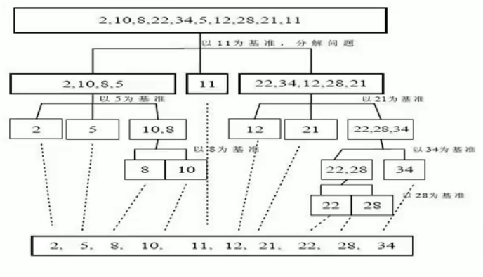

# 快速排序

- ## 基本介绍

  快速排序(quick sort)是对冒泡排序的一种改进.基本思想是:通过一趟排序将要排序的数据分割成独立的两部分,其中一部分的所有数据都比另一部分的所有数据都要小,然后再按此方法对这两部分数据分别进行快速排序,整个过程排序的过程可以递归进行,以此达到整个数据变成有序序列.
  
- ## 快速排序示意图

  

- ## 代码案例

  ```java
  package com.structures.sort;
  
  public class QuickSort {
      public static void main(String[] args) {
          int[] arr = new int[800000];
          for (int i = 0; i < 800000; i++) {
              arr[i] = (int) (Math.random() * 8000000);
          }
          long start = System.currentTimeMillis();
          quickSort(arr, 0, arr.length - 1);
          long end = System.currentTimeMillis();
          System.out.println("耗时:" + ((end - start)) + "ms");
          /*
          耗时:20ms
           */
      }
  
      public static void quickSort(int[] arr, int left, int right) {
          int l = left;//左下标
          int r = right;//右下标
  
          //中间值
          int pivot = arr[(left + right) / 2];
          int temp = 0;
          //让比pivot值小的放到左边,比pivot大的值放到右边
          while (l < r) {
              //在pivot的左边一直找,直到大于pivot值,才退出
              while (arr[l] < pivot) {
                  l += 1;
              }
  
              //在pivot的右边一直找,找到小于等于pivot值,才退出
              while (arr[r] > pivot) {
                  r -= 1;
              }
              //如果l >= r说明pivot左右两边的值,已全部分好
              if (l >= r) {
                  break;
              }
              //交换左右
              temp = arr[l];
              arr[l] = arr[r];
              arr[r] = temp;
              //如果交换完后发现arr[l] == pivot 值,那么r就前移
              if (arr[l] == pivot) {
                  r -= 1;
              }
              //如果交换完后发现arr[r] == pivot 值,那么l就后移
              if (arr[r] == pivot) {
                  l += 1;
              }
          }
  
          //如果1==r,必须l++,r--,否则栈溢出
          if (l == r) {
              l += 1;
              r -= 1;
          }
  
          //向左递归
          if (left < r) {
              quickSort(arr, left, r);
          }
          //向右递归
          if (right > l) {
              quickSort(arr, l, right);
          }
  
      }
  }
  
  ```
