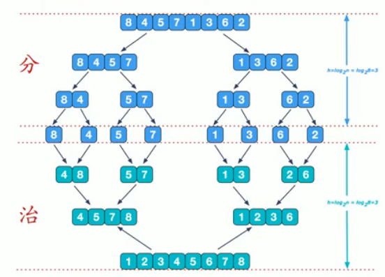
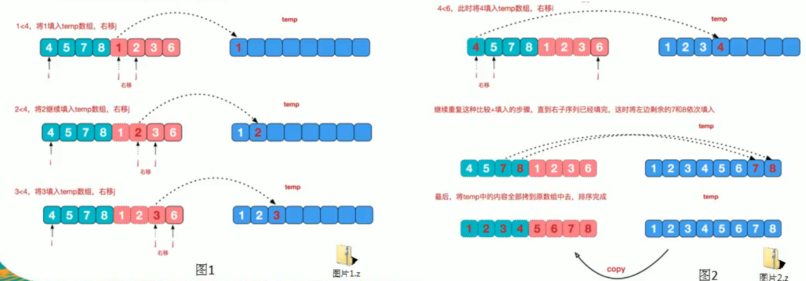

# 归并排序

- ## 基本介绍

  归并排序(merge-sort)是利用归并的思想实现的排序方法,该算法采用经典的分治(divide-and-conquer)策略(分治法将问题**分**(divide)成一些小的问题然后递归求解,而**治**(conquer)的阶段则将分的阶段得到的答案"修补"在一起,即分而治之).

- ## 示意图

  

  说明:可以看到这种结构很像一颗完全二叉树,本文的归并排序我们采用递归去实现(也可以采用迭代的方式去实现).分阶段可以理解为就是递归拆分子序列的过程.

  再来看看**治**阶段,我们需要将两个已经有序的子序列合并成一个有序序列,比如下图的最有一次合并,要将[4,5,7,8]和[1,2,3,6]两个已经有序的子序列,合并为最终序列[1,2,3,4,5,6,7,8],来看下实现步骤.

  

- ## 代码示例

  ```java
    package com.structures.sort;
  
  public class MergeSort {
      public static void main(String[] args) {
          int[] arr = new int[80000];
          for (int i = 0; i < 80000; i++) {
              arr[i] = (int) (Math.random() * 8000000);
          }
          int[] temp = new int[arr.length];
          long start = System.currentTimeMillis();
  
          mergeSort(arr,0,arr.length-1,temp);
          long end = System.currentTimeMillis();
          System.out.println("耗时:" + ((end - start)) + "ms");
          /*
          耗时:15ms
           */
      }
  
      //分+合
      public static void mergeSort(int[] arr, int left, int right, int[] temp) {
          if (left < right) {
              int mid = (left + right) / 2;
              //向左递归进行分解
              mergeSort(arr, left, mid, temp);
              //向右递归进行分解
              mergeSort(arr, mid + 1, right, temp);
              //合并
              merge(arr, left, mid, right, temp);
          }
      }
  
      /**
       * 合并
       * @param arr   已排序的原始数组
       * @param left  左边有序序列的初始索引
       * @param mid   中间索引
       * @param right 右边索引
       * @param temp  做中转数组
       */
      public static void merge(int[] arr, int left, int mid, int right, int[] temp) {
          int i = left;//初始化i,左边有序序列的初始索引
          int j = mid + 1;//初始化j,右边有序序列的初始索引
          int t = 0;//指向temp数组的当前索引
  
          //(一)
          //先把左右两边(有序)的数据按照规则填充到temp数组
          //直到左右两边的有序序列,有一边处理完毕为止,即全部填充到temp数组
          while (i <= mid && j <= right) {
              //如果左边的有序序列小于等于右边的有序序列的当前元素
              //即将左边的当前元素拷贝到temp数组
              //然后t++,i++后移
              if (arr[i] <= arr[j]) {
                  temp[t] = arr[i];
                  t += 1;
                  i += 1;
              } else {//反之,将右边有序序列的当前元素,填充到temp数组
                  temp[t] = arr[j];
                  t += 1;
                  j += 1;
              }
          }
  
          //(二)
          //把有剩余数据的一边的数据依次填充到temp
          while (i <= mid) {//左边的还有剩余,填充到temp数组
              temp[t] = arr[i];
              t += 1;
              i += 1;
          }
          while (j <= right) {
              temp[t] = arr[j];
              t += 1;
              j += 1;
          }
  
          //(三)
          //将temp数组的元素拷贝到arr
          //注意并不是每次都拷贝所有
          //第一次合并leftTemp = 0,right = 1,第二次合并leftTemp = 2,right = 3,第三次合并leftTemp = 0,right = 3...
          t = 0;
          int leftTemp = left;
          while (leftTemp <= right) {
              arr[leftTemp] = temp[t];
              leftTemp += 1;
              t += 1;
          }
      }
  }
  
  ```
