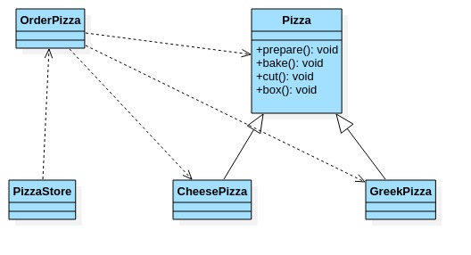
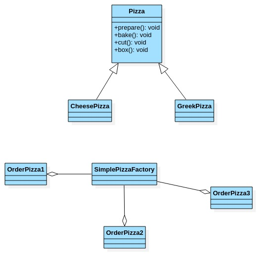

# 简单工厂模式

- ## 具体需求

    一个生产披萨项目:要便于披萨种类的扩展,要便于维护.

    1. 披萨的种类很多(比如GreekPizza,CheesePizza等).
    2. 披萨的制作有:prepare,bake,cut,box.
    3. 完成披萨店订购功能.

- ## 传统方式UML图

  

- ## 传统方式代码

  ```java
  package com.xie.factory;simplefactory2
  
  public abstract class Pizza {
      private String name;
  
      //准备原材料,不同的披萨不一样,因此做成抽象方法.
      public abstract void prepare();
  
      public void bake() {
          System.out.println(name + " baking");
      }
  
      public void cut() {
          System.out.println(name + " cutting");
      }
  
      public void box() {
          System.out.println(name + " boxing");
      }
  
      public void setName(String name) {
          this.name = name;
      }
  }
  ```

  ```java
  package com.xie.factory;
  
  public class CheesePizza extends Pizza {
      @Override
      public void prepare() {
          System.out.println("给奶酪披萨 准备原材料");
      }
  }
  ```

  ```java
  package com.xie.factory;
  
  public class GreekPizza extends Pizza {
      @Override
      public void prepare() {
          System.out.println("给希腊披萨 准备原材料");
      }
  }
  ```

  ```java
  package com.xie.factory;
  
  import java.io.BufferedReader;
  import java.io.IOException;
  import java.io.InputStreamReader;
  
  public class OrderPizza {
      //构造器
      public OrderPizza() {
          Pizza pizza = null;
          String orderType;//订购披萨类型
          do {
              orderType = getType();
              if (orderType.equals("greek")) {
                  pizza = new GreekPizza();
                  pizza.setName("希腊披萨");
              } else if (orderType.equals("cheese")) {
                  pizza = new CheesePizza();
                  pizza.setName("奶酪");
              } else {
                  break;
              }
              pizza.prepare();
              pizza.bake();
              pizza.cut();
              pizza.box();
          } while (true);
      }
  
      //写一个方法,可以获取客户希望订购的披萨类型
      private String getType() {
          BufferedReader bufferedReader = new BufferedReader(new InputStreamReader(System.in));
          System.out.println("input pizza type");
          String s = null;
          try {
              s = bufferedReader.readLine();
              return s;
          } catch (IOException e) {
              e.printStackTrace();
              return "";
          }
      }
  }
  ```

  ```java
  package com.xie.factory;
  
  //相当于一个客户端,发出订购
  public class PizzaStore {
      public static void main(String[] args) {
          OrderPizza orderPizza = new OrderPizza();
      }
  }
  ```

- ## 方式的优缺点

  1. 优点:简单,易理解操作.
  2. 缺点是违反了设计模式的cop原则,即对扩展开放,对修改关闭.即当我们给类增加新功能的时候,尽量不修改代码,或者尽量少修改代码.
  3. 当我们需要新增一种披萨时,需要修改客户端的代码.

- ## 改进思路

  分析:修改代码可以接受,但是如果我们在其它的地方也有创建pizza的代码,就意味着,也需要修改,而创建pizza的代码,往往有多处.

  思路:把创建pizza对象封装到一个类中,这样我们有新的pizza种类时,只需要修改该类就可,其它创建到pizza对象的代码就不需要修改了->简单工厂模式.

- ## 简单工厂模式介绍

  1. 简单工厂模式是属于创建型模式,是工厂模式的一种.简单工厂模式由一个工厂对象决定创建出哪一种产品类的实例.简单工厂模式是工厂模式家族中最简单实用的模式.
  2. 简单工厂模式:定义了一个创建对象的类,由这个类封装实例化对象的行为(代码).
  3. 在软件开发中,当我们会用到大量的创建某种类或者某批对象时,就会使用到工厂模式.

- ## UML图

  

- ## 修改代码

  1. 新增一个简单工厂类.

     ```java
     package com.xie.factory;

     //简单工厂类
     public class SimplePizzaFactory {

         //根据orderType返回对应pizza对象
         public Pizza createPizza(String orderType) {
             Pizza pizza = null;
             if (orderType.equals("greek")) {
                 pizza = new GreekPizza();
                 pizza.setName("希腊披萨");
             } else if (orderType.equals("cheese")) {
                 pizza = new CheesePizza();
                 pizza.setName("奶酪");
             }
             return pizza;
         }
     }
     ```

  2. 修改OrderPizza代码,将简单工厂类聚合进来.

     ```java
     package com.xie.factory;

     import java.io.BufferedReader;
     import java.io.IOException;
     import java.io.InputStreamReader;

     public class OrderPizza {
         //构造器
        /* public OrderPizza() {
             Pizza pizza = null;
             String orderType;//订购披萨类型
             do {
                 orderType = getType();
                 if (orderType.equals("greek")) {
                     pizza = new GreekPizza();
                     pizza.setName("希腊披萨");
                 } else if (orderType.equals("cheese")) {
                     pizza = new CheesePizza();
                     pizza.setName("奶酪");
                 } else {
                     break;
                 }
                 pizza.prepare();
                 pizza.bake();
                 pizza.cut();
                 pizza.box();
             } while (true);
         }*/
         SimplePizzaFactory simplePizzaFactory;
         Pizza pizza = null;
         //构造器
         public OrderPizza(SimplePizzaFactory simplePizzaFactory) {
             setSimplePizzaFactory(simplePizzaFactory);
         }
         public void setSimplePizzaFactory(SimplePizzaFactory simplePizzaFactory) {
             String orderType = "";//由用户输入
             this.simplePizzaFactory = simplePizzaFactory;//设置简单工厂对象
             do {
                 orderType = getType();
                 pizza = this.simplePizzaFactory.createPizza(orderType);
                 if (pizza != null) {
                     pizza.prepare();
                     pizza.bake();
                     pizza.cut();
                     pizza.box();
                 } else {
                     System.out.println("订购披萨失败!");
                     break;
                 }
             } while (true);
         }


         //写一个方法,可以获取客户希望订购的披萨类型
         private String getType() {
             BufferedReader bufferedReader = new BufferedReader(new InputStreamReader(System.in));
             System.out.println("input pizza type");
             String s = null;
             try {
                 s = bufferedReader.readLine();
                 return s;
             } catch (IOException e) {
                 e.printStackTrace();
                 return "";
             }
         }
     }
     ```

  3. 修改PizzaStore代码.

     ```java
     package com.xie.factory;
     //相当于一个客户端,发出订购
     public class PizzaStore {
         public static void main(String[] args) {
             OrderPizza orderPizza = new OrderPizza(new SimplePizzaFactory());
         }
     }
     ```
