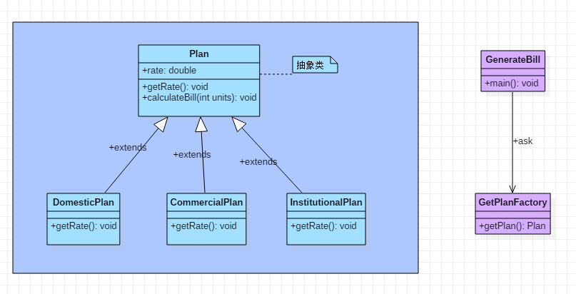

# 工厂方法模式

工厂模式或工厂方法模式表示，只需定义用于创建对象的接口或抽象类，但让子类确定要实例化的类。 换句话说，子类负责创建该类的实例。

工厂方法模式也被称为虚拟构造函数。

## 工厂方法的优势

1. 工厂方法模式允许子类选择要创建的对象的类型 。
2. 它消除了将特定于应用程序的类绑定到代码中的需要，从而促进了松散耦合。 这意味着代码仅与结果接口或抽象类交互，因此它将与实现该接口或扩展该抽象类的任何类一起使用。

## 何时使用

- 当一个类不知道创建哪种子类时
- 当一个类希望其子类指定创建的对象时
- 当父类选择为其子类创建对象时

## 工厂方法UML图

- 我们将创建一个计划抽象类和扩展计划抽象类的具体类。下一步将定义工厂类GetPlanFactory。
- GenerateBill类将使用GetPlanFactory获取一个Plan对象。它将信息（DomesticPlan/ CommercialPlan/ InstitutionalPlan）传递给GetPalnFactory以获取所需的对象类型。


## 计算电费：工厂方法的真实示例

- 第一步：创建一个计算计划抽象类
  
    ```java
    import java.io.*;
    abstract class Plan{  
        protected double rate;  
        abstract void getRate();  

        public void calculateBill(int units){  
            System.out.println(units*rate);  
        }  
    }
    ```

- 第二步：创建扩展Plan抽象类的具体类
  
    ```java
    class  DomesticPlan extends Plan{  
        //@override  
         public void getRate(){  
             rate=3.50;
        }  
   }
    ```

    ```java
    class  CommercialPlan extends Plan{  
        //@override
        public void getRate(){
            rate=7.50;  
        }
    }
    ```

    ```java
    class  InstitutionalPlan extends Plan{  
        //@override  
        public void getRate(){
            rate=5.50;  
        }
    }
    ```

- 第三步：创建一个GetPlanFactory以根据给定的信息生成具体类的对象
  
    ```java
    class GetPlanFactory{  
        //接受不同的参数返回不同的Plan  
       public Plan getPlan(String planType){  
            if(planType == null){  
             return null;  
            }  
          if(planType.equalsIgnoreCase("DOMESTICPLAN")) {  
                 return new DomesticPlan();  
               }
           else if(planType.equalsIgnoreCase("COMMERCIALPLAN")){  
                return new CommercialPlan();  
            }
          else if(planType.equalsIgnoreCase("INSTITUTIONALPLAN")) {  
                return new InstitutionalPlan();  
          }  
            return null;  
        }  
    }
    ```

- 第四步：通过传递诸如计划类型DomesticPlan或CommercialPlan或InstitutionalPlan之类的信息，使用GetPlanFactory生成具体类的对象来生成Bill。

    ```java
    import java.io.*;
    class GenerateBill{  
        public static void main(String args[])throws IOException{  
          GetPlanFactory planFactory = new GetPlanFactory();  

          System.out.print("Enter the name of plan for which the bill will be generated: ");  
          BufferedReader br=new BufferedReader(new InputStreamReader(System.in));  

          String planName=br.readLine();  
          System.out.print("Enter the number of units for bill will be calculated: ");  
          int units=Integer.parseInt(br.readLine());  

          Plan p = planFactory.getPlan(planName);  


          System.out.print("Bill amount for "+planName+" of  "+units+" units is: ");  
               p.getRate();  
               p.calculateBill(units);  
        }  
    }
    ```
