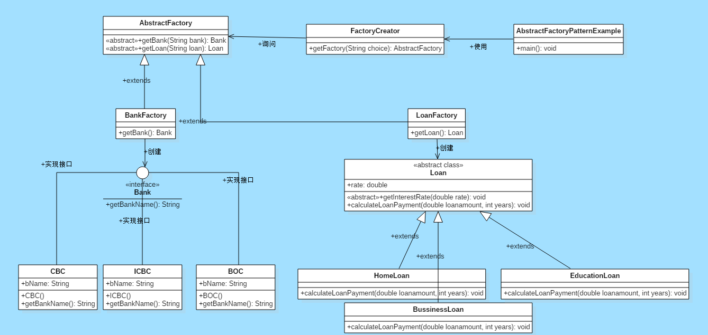

# 抽象工厂模式

抽象工厂模式，只需定义一个接口或抽象类来创建相关（或依赖）对象的族，而无需指定它们的具体子类。这意味着Abstract Factory让一个类返回一个类的工厂。因此，这就是“抽象工厂模式”比“工厂模式”高一级的原因。

## 抽象工厂的优势

- 抽象工厂模式将客户代码与具体（实现）类隔离。
- 它简化了对象族的交换。
- 促进对象之间的一致性。

## 何时使用

- 当系统需要独立于其对象的创建，组成和表示方式。
- 当相关对象系列必须一起使用时，则需要强制执行此约束。
- 当您想要提供不显示实现而仅显示接口的对象库时。
- 需要使用多个对象系列之一配置系统时。

## 抽象工厂UML图

- 创建一个Bank接口和一个Loan抽象类及其子类。
- 然后创建AbstractFactory类作为下一步。
- 创建具体类，BankFactory和LoanFactory，它们将扩展AbstractFactory类。
- 之后，AbstractFactoryPatternExample类使用FactoryCreator来获取AbstractFactory类的对象。


## 抽象工厂实例：计算CBC，ICBC，BOC等不同银行的贷款偿还额

- 第一步：创建一个Bank接口

```java
import java.io.*;
interface Bank{  
        String getBankName();  
}
```

- 第二步：创建实现Bank接口的具体类

```java
class CBC implements Bank{  
    private final String BNAME;  
    public HDFC(){  
        BNAME="HDFC BANK";  
    }  
    public String getBankName() {  
        return BNAME;  
    }  
}
```

```java
class ICBC implements Bank{  
   private final String BNAME;  
   ICICI(){  
        BNAME="ICICI BANK";  
    }  
    public String getBankName() {  
        return BNAME;  
   }  
}
```

```java
class BOC implements Bank{  
    private final String BNAME;  
    public SBI(){  
        BNAME="SBI BANK";  
    }  
    public String getBankName(){  
        return BNAME;  
    }  
}
```

- 第三步：创建贷款抽象类

```java
abstract class Loan{  
   protected double rate;  
   abstract void getInterestRate(double rate);  
   public void calculateLoanPayment(double loanamount, int years)  
   {  
        /*
              to calculate the monthly loan payment i.e. EMI

              rate=annual interest rate/12*100;
              n=number of monthly installments;
              1year=12 months.
              so, n=years*12;

            */  

         double EMI;  
         int n;  
  
         n=years*12;  
         rate=rate/1200;  
         EMI=((rate*Math.pow((1+rate),n))/((Math.pow((1+rate),n))-1))*loanamount;  
  
        System.out.println("your monthly EMI is "+ EMI +" for the amount"+loanamount+" you have borrowed");
 }  
}
```

- 第四步：创建扩展Loan抽象类的具体类

```java
class HomeLoan extends Loan{  
     public void getInterestRate(double r){  
         rate=r;  
    }  
}
```

```java
class BussinessLoan extends Loan{  
    public void getInterestRate(double r){  
          rate=r;  
     }  
  
}
```

```java
class EducationLoan extends Loan{  
     public void getInterestRate(double r){  
       rate=r;  
 }  
}
```

- 第五步：创建一个抽象类（即AbstractFactory）以获取Bank和Loan Objects的工厂
  
```java
abstract class AbstractFactory{  
  public abstract Bank getBank(String bank);  
  public abstract Loan getLoan(String loan);  
}
```

- 第六步：创建继承AbstractFactory类的工厂类，以基于给定信息生成具体类的对象
  
```java
class BankFactory extends AbstractFactory{  
   public Bank getBank(String bank){  
      if(bank == null){  
         return null;  
      }  
      if(bank.equalsIgnoreCase("HDFC")){  
         return new HDFC();  
      } else if(bank.equalsIgnoreCase("ICICI")){  
         return new ICICI();  
      } else if(bank.equalsIgnoreCase("SBI")){  
         return new SBI();  
      }  
      return null;  
   }  
  public Loan getLoan(String loan) {  
      return null;  
   }  
}
```

```java
class LoanFactory extends AbstractFactory{  
        public Bank getBank(String bank){  
            return null;  
        }  

     public Loan getLoan(String loan){  
      if(loan == null){  
         return null;  
      }  
      if(loan.equalsIgnoreCase("Home")){  
         return new HomeLoan();  
      } else if(loan.equalsIgnoreCase("Business")){  
         return new BussinessLoan();  
      } else if(loan.equalsIgnoreCase("Education")){  
         return new EducationLoan();  
      }  
      return null;  
   }  
}
```

- 第七步：创建一个FactoryCreator类，以通过传递诸如银行或贷款之类的信息来获取工厂

```java
class FactoryCreator {  
     public static AbstractFactory getFactory(String choice){  
      if(choice.equalsIgnoreCase("Bank")){  
         return new BankFactory();  
      } else if(choice.equalsIgnoreCase("Loan")){  
         return new LoanFactory();  
      }  
      return null;  
   }  
}
```

- 第八步：使用FactoryCreator来获取AbstractFactory，以便通过传递诸如类型之类的信息来获得具体类的工厂
  
```java
import java.io.*;  
class AbstractFactoryPatternExample {  
      public static void main(String args[])throws IOException {  

      BufferedReader br=new BufferedReader(new InputStreamReader(System.in));  
  
      System.out.print("Enter the name of Bank from where you want to take loan amount: ");  
      String bankName=br.readLine();  
  
     System.out.print("\n");  
     System.out.print("Enter the type of loan e.g. home loan or business loan or education loan : ");  
  
     String loanName=br.readLine();  
     AbstractFactory bankFactory = FactoryCreator.getFactory("Bank");  
     Bank b=bankFactory.getBank(bankName);  
  
     System.out.print("\n");  
     System.out.print("Enter the interest rate for "+b.getBankName()+ ": ");  
  
     double rate=Double.parseDouble(br.readLine());  
     System.out.print("\n");  
     System.out.print("Enter the loan amount you want to take: ");  
  
     double loanAmount=Double.parseDouble(br.readLine());  
     System.out.print("\n");  
     System.out.print("Enter the number of years to pay your entire loan amount: ");  
     int years=Integer.parseInt(br.readLine());  
  
     System.out.print("\n");  
     System.out.println("you are taking the loan from "+ b.getBankName());  
  
     AbstractFactory loanFactory = FactoryCreator.getFactory("Loan");  
     Loan l=loanFactory.getLoan(loanName);  
     l.getInterestRate(rate);  
     l.calculateLoanPayment(loanAmount,years);  
  }  
}
```
