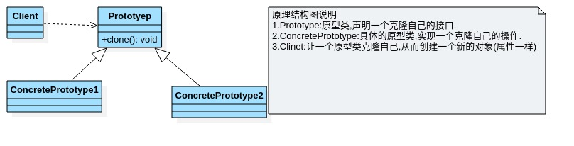

# 原型模式

- ## 克隆羊问题

  现在有一只羊tom,姓名为:tom,年龄为:1,颜色为:白色,请编写程序创建和tom羊属性完全相同的10只羊.
  
- ## 传统方式案例

  ```java
  package com.xie.prototype;
  
  public class Sheep {
      private String name;
      private int age;
      private String color;
  
      public Sheep(String name, int age, String color) {
          this.name = name;
          this.age = age;
          this.color = color;
      }
  
      public String getName() {
          return name;
      }
  
      public void setName(String name) {
          this.name = name;
      }
  
      public int getAge() {
          return age;
      }
  
      public void setAge(int age) {
          this.age = age;
      }
  
      public String getColor() {
          return color;
      }
  
      public void setColor(String color) {
          this.color = color;
      }
  
      @Override
      public String toString() {
          return "Sheep{" +
                  "name='" + name + '\'' +
                  ", age=" + age +
                  ", color='" + color + '\'' +
                  '}';
      }
  }
  
  ```

  ```java
  package com.xie.prototype;
  
  public class Client {
      public static void main(String[] args) {
          Sheep tom1 = new Sheep("tom", 1, "白色");
          Sheep sheep1 = new Sheep(tom1.getName(), tom1.getAge(), tom1.getColor());
          Sheep sheep2 = new Sheep(tom1.getName(), tom1.getAge(), tom1.getColor());
          Sheep sheep3 = new Sheep(tom1.getName(), tom1.getAge(), tom1.getColor());
          Sheep sheep4 = new Sheep(tom1.getName(), tom1.getAge(), tom1.getColor());
          Sheep sheep5 = new Sheep(tom1.getName(), tom1.getAge(), tom1.getColor());
          System.out.println(sheep1);
          System.out.println(sheep2);
          System.out.println(sheep3);
          System.out.println(sheep4);
          System.out.println(sheep5);
          System.out.println(sheep5);
      }
  }
  
  ```

- ## 优缺点分析

  1. 优点是比较好理解,简单易操作.
  2. 在创建新对象时,总是需要重新获取原始对象的属性,如果创建的对象比较复杂时,效率较低.
  3. 总是需要重新初始化对象,而不是动态得获得对象运行时的状态,不够灵活.
  4. 改进思路:Java中的Object类是所有类的根类,Object类提供一个clone方法,该方法可以将一个Java对象复制一份,但是需要实现clone的Java类必须实现一个接口Cloneable,该接口表示该类能够复制且具有复制的能力=>圆形模式.

- ## 原型模式-基本介绍

  1. 原型模式(Prototye模式)是指:用原型实例指定创建对象的种类,并且通过拷贝这些原型,创建新的对象.
  2. 原型模式一种创建型设计模式,允许一个对象再创建另外一个可定制的对象,无需知道如何创建的细节.
  3. 工作原理是:通过将一个原型对象传给那个要发动创建的对象,这个要发动创建的对象通过请求原型对象拷贝它们自己来实施创建,即对象clone().

- ## UML

  

- ## 案例

  ```java
  package com.xie.prototype;
  
  public class Sheep implements Cloneable{
      private String name;
      private int age;
      private String color;
  
      public Sheep(String name, int age, String color) {
          this.name = name;
          this.age = age;
          this.color = color;
      }
  
      public String getName() {
          return name;
      }
  
      public void setName(String name) {
          this.name = name;
      }
  
      public int getAge() {
          return age;
      }
  
      public void setAge(int age) {
          this.age = age;
      }
  
      public String getColor() {
          return color;
      }
  
      public void setColor(String color) {
          this.color = color;
      }
  
      @Override
      public String toString() {
          return "Sheep{" +
                  "name='" + name + '\'' +
                  ", age=" + age +
                  ", color='" + color + '\'' +
                  '}';
      }
  
      //克隆该实例,使用默认的clone方法来实现
      @Override
      public Object clone() {
          Sheep sheep = null;
          try {
              sheep = (Sheep) super.clone();
          } catch (CloneNotSupportedException e) {
              e.printStackTrace();
          }
          return sheep;
      }
  }
  
  ```

  ```java
  package com.xie.prototype;
  
  public class Client {
      public static void main(String[] args) {
          Sheep tom1 = new Sheep("tom", 1, "白色");
          Sheep sheep1 = (Sheep) tom1.clone();
          Sheep sheep2 = (Sheep) tom1.clone();
          Sheep sheep3 = (Sheep) tom1.clone();
          Sheep sheep4 = (Sheep) tom1.clone();
          Sheep sheep5 = (Sheep) tom1.clone();
          System.out.println(sheep1);
          System.out.println(sheep2);
          System.out.println(sheep3);
          System.out.println(sheep4);
          System.out.println(sheep5);
  
      }
  }
  
  ```

- ## 关于深拷贝

  该类实现Serializable接口,并创建序列化方法.

  ```java
  //深拷贝
      public Object deepCopy() {
          //创建对象流
          ByteArrayInputStream bis = null;
          ObjectInputStream ois = null;
          try (ByteArrayOutputStream bos = new ByteArrayOutputStream();
               ObjectOutputStream oos = new ObjectOutputStream(bos);) {
              //序列化
              oos.writeObject(this);
  
              //反序列化
              bis = new ByteArrayInputStream(bos.toByteArray());
              ois = new ObjectInputStream(bis);
              return ois.readObject();
          } catch (IOException | ClassNotFoundException e) {
              e.printStackTrace();
              return null;
          }finally {
              try {
                  if (bis != null) {
                      bis.close();
                  }
                  if (ois != null) {
                      ois.close();
                  }
              } catch (IOException e) {
                  e.printStackTrace();
              }
          }
  
      }
  ```
