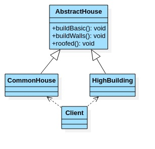

# 建造者模式

- ## 需求

  盖房项目需求:
  1.需要建房子:这一过程为打桩,砌墙,封顶.

  2.房子有各种各样的,比如普通墙房,高楼,别墅,各种房子的过程虽然一样,但是要求不要相同.

- ## 传统方式UML

  

- ## 传统方式代码案例

  ```java
  package com.xie.builder;
  
  public abstract class AbstractHouse {
      //打地基
      public abstract void buildBasic();
      //砌墙
      public abstract void buildWalls();
      //封顶
      public abstract void roofed();
      public void build(){
          buildBasic();
          buildWalls();
          roofed();
      }
  }
  
  ```

  ```java
  package com.xie.builder;
  
  public class CommonHouse extends AbstractHouse {
      @Override
      public void buildBasic() {
          System.out.println("给普通房子打地基");
      }
  
      @Override
      public void buildWalls() {
          System.out.println("给普普通房子砌墙");
      }
  
      @Override
      public void roofed() {
          System.out.println("给普通房子封顶");
      }
  }
  
  ```

  ```java
  package com.xie.builder;
  
  public class Client {
      public static void main(String[] args) {
          CommonHouse commonHouse = new CommonHouse();
          commonHouse.build();
      }
  }
  
  ```

- ## 传统方式需求问题分析

  1. 优点是比较好理解,简单易操作.
  2. 设计的程序结构,过于简单,没有设计缓存层对象,程序的扩展和维护不好,也就是说,这种设计方案,把产品和创建产品的过程封装在一起,耦合性变强了.
  3. 解决方案:将产品和产品建造的过程解耦=>建造者模式.

- ## 建造者模式基本介绍

  1. 建造者模式(Builder Pattern)又叫生成器模式,是一种对象构建模式.它可以将复杂对象的建造过程抽象出来(抽象类别),使这个抽象过程的不同实现方法可以构造出不同表现(属性)的对象.
  2. 建造者模式是一步一步创建一个对象,它允许用户只通过指定复杂对象的类型和内容就可以构建他们,用户不需要知道内部的具体构建细节.

- ## 建造者模式的四个角色

  1. Product(产品角色):一个具体的产品对象.
  2. Builder(抽象建造者):创建一个Product对象的各个部件指定的抽象类\接口.
  3. ConcreteBuilder(具体建造者):实现接口,构建和装备各个部件.
  4. Director(指挥者):构建一个使用Builder接口的对象.它主要用于创建一个复杂的对象.它的主要作用,一是:隔离了客户与对象的生产过程,二是:负责控制产品对象的生产过程.
  
- ## 建造者模式UML

  ![build2.jpg][build2]

- ## 建造者模式代码案例

  ```java
  package com.xie.builder;
  
  //产品
  public class House {
      private String basic;
      private String wall;
      private String roofed;
  
      public String getBasic() {
          return basic;
      }
  
      public void setBasic(String basic) {
          this.basic = basic;
      }
  
      public String getWall() {
          return wall;
      }
  
      public void setWall(String wall) {
          this.wall = wall;
      }
  
      public String getRoofed() {
          return roofed;
      }
  
      public void setRoofed(String roofed) {
          this.roofed = roofed;
      }
  }
  
  ```

  ```java
  package com.xie.builder;
  
  //抽象的建造者
  public abstract class HouseBuilder {
      protected House house = new House();
  
      //将建造的流程写好,抽象的方法
      public abstract void buildBasic();
      public abstract void buildWalls();
      public abstract void roofed();
  
      //建造房子
      public House buildHouse(){
  
          return house;
      }
  }
  
  ```

  ```java
  package com.xie.builder;
  
  public class CommonHouse extends HouseBuilder {
      @Override
      public void buildBasic() {
          System.out.println("给普通房子打地基");
      }
  
      @Override
      public void buildWalls() {
          System.out.println("给普普通房子砌墙");
      }
  
      @Override
      public void roofed() {
          System.out.println("给普通房子封顶");
      }
  }
  
  ```

  ```java
  package com.xie.builder;
  
  public class HighBuilding extends HouseBuilder {
      @Override
      public void buildBasic() {
          System.out.println("高楼的地基");
      }
  
      @Override
      public void buildWalls() {
          System.out.println("高楼的砌墙");
      }
  
      @Override
      public void roofed() {
          System.out.println("高楼的封顶");
      }
  
  }
  
  ```

  ```java
  package com.xie.builder;
  
  //指挥者,动态的去指定制作流程.
  public class HouseDirector {
      private HouseBuilder houseBuilder = null;
  
      //构造器传入
      public HouseDirector(HouseBuilder houseBuilder) {
          this.houseBuilder = houseBuilder;
      }
  
      //通过setter传入
      public void setHouseBuilder(HouseBuilder houseBuilder) {
          this.houseBuilder = houseBuilder;
      }
  
      //如何处理建造房子的流程,交给指挥者.
      public House constructHouse() {
          houseBuilder.buildBasic();
          houseBuilder.buildWalls();
          houseBuilder.roofed();
          return houseBuilder.buildHouse();
      }
  }
  
  ```

  ```java
  package com.xie.builder;
  
  public class Client {
      public static void main(String[] args) {
          //盖普通房子
          CommonHouse commonHouse = new CommonHouse();
          //装备创建房子的指挥者
          HouseDirector houseDirector = new HouseDirector(commonHouse);
          //完成盖房子,返回房子
          House house = houseDirector.constructHouse();
      }
  }
  
  ```
