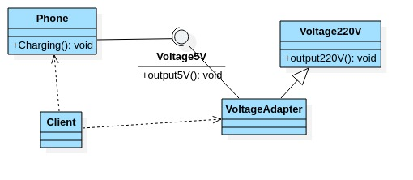
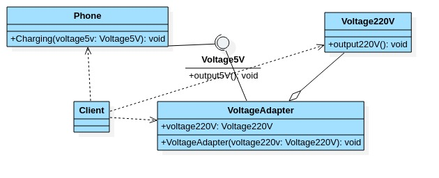
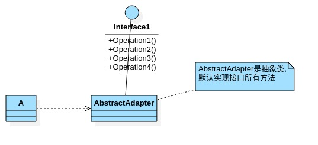

# 适配器模式

- ## 基本介绍

  1. 适配器模式(Adapter pattern) 将某个类的接口转换成客户端期望的另一个接口表示,主要目的是兼容,让原本因接口不匹配不能一起工作的两个类可以协同工作.其别名为包装器(Wrapper).
  2. 适配器属于结构型模式.
  3. 主要分为三类:类适配器模式,对象适配器模式,接口适配器模式.

- ## 工作原理

  1. 适配器模式:将一个类的接口转成另一种接口,让原本不兼容的类可以兼容.
  2. 从用户的角度看不到被适配者,是解耦的.
  3. 用户调用适配器转化出来的目标接口方法,适配器再调用被适配者的相关接口方法.
  4. 用户收到反馈结果,感觉只是和目标接口交互.

- ## 类适配器UML

  

- ## 类适配器案例

  适配器将220V=>5V

  ```java
  package com.xie.adapter;
  
  //被适配类
  public class Voltage220V {
      public int output220V() {
          int src = 220;
          System.out.println("电压=" + src+"伏");
          return src;
      }
  }
  
  ```

  ```java
  package com.xie.adapter;
  
  //适配接口
  public interface Voltage5V {
      int output5V();
  }
  
  ```

  ```java
  package com.xie.adapter;
  
  //适配器类,
  public class VoltageAdapter extends Voltage220V implements Voltage5V {
      @Override
      public int output5V() {
          //获取到220v
          int src = output220V();
          //转成5v
          int dst = src / 44;
          return dst;
      }
  }
  
  ```

  ```java
  package com.xie.adapter;
  
  public class Phone {
      //充电
      public void charging(Voltage5V voltage5V){
          if(voltage5V.output5V() == 5){
              System.out.println("电压为5v,可以充电");
          }else if(voltage5V.output5V() > 5){
              System.out.println("电压大于5v,不能充电");
          }
      }
  }
  
  ```

  ```java
  package com.xie.adapter;
  
  public class Client {
      public static void main(String[] args) {
          System.out.println("======类适配器模式=======");
          Phone phone = new Phone();
          phone.charging(new VoltageAdapter());
      }
  }
  
  ```

  类适配器注意事项和细节:

  1. Java是单继承机制,所以类适配器需要继承src类这一点算是一个缺点,因为这要求dst必须是接口,有一定的局限性.
  2. src类的方法在Adapter中都会暴露出来,也增加了使用的成本.
  3. 由于其继承了src类,所以它可以根据需求重写src类的方法,使得Adapter的灵活性增强了.

- ## 对象适配器

  1. 基本思路和类的适配器模式相同,只是将Adapter类作修改,不是继承src类,而是持有src类的实例,以解决兼容性的问题.即:持有src类,实现dst类接口,完成src=>dst的适配.
  2. 根据"合成复用原则",在系统中尽量使用关联关系来替代继承关系.
  3. 对象适配器模式是适配器模式中常用的一种.

- ## 对象适配器UML

  

- ## 对象适配器案例(修改)

  ```java
  package com.xie.adapter;
  
  //适配器类,
  public class VoltageAdapter  implements Voltage5V {
      private Voltage220V voltage220V;//关联关系-聚合关系
  
      //通过构造器传入一个Voltage220V实例
      public VoltageAdapter(Voltage220V voltage220V) {
          this.voltage220V = voltage220V;
      }
  
      @Override
      public int output5V() {
          //获取到220v
          if(voltage220V != null){
              int src = voltage220V.output220V();
              System.out.println("使用对象适配器,进行适配~~");
              //转成5v
              int dst = src / 44;
              return dst;
          }
          return 0;
      }
  }
  
  ```

  ```java
  package com.xie.adapter;
  
  public class Client {
      public static void main(String[] args) {
          System.out.println("======类适配器模式=======");
          Phone phone = new Phone();
          phone.charging(new VoltageAdapter(new Voltage220V()));
      }
  }
  
  ```

- ## 对象适配器模式注意事项和细节

  1. 对象适配器和类适配器其实算是同一种思想,只不过是实现方式不同.
  2. 根据合成服用原则,使用组合替代继承,所以它解决了类适配器必须继承src的局限性问题,也不在要求dst必须是接口.
  3. 使用成本更低,更灵活.

- ## 接口适配器模式

  1. 一些书籍称为:适配器(Default Adapter pattern)或缺省适配器模式.
  2. 当不需要全部实现接口提供的方法时,可以先设计一个抽象类实现接口,并为该接口中的每个方法提供一个默认实现(方法),那么抽象类的子类可以有选择的覆盖父类的某些方法来实现需求.
  3. 适用于一个接口不想使用其所有的方法情况.

- ## 接口适配器UML

  

- ## 接口适配器案例

  ```java
  package com.xie.adapter;
  
  public interface Interface4 {
      public void m1();
      public void m2();
      public void m3();
      public void m4();
  }
  
  ```

  ```java
  package com.xie.adapter;
  
  //在AbstractAdapter 我们将Interface4的方法进行默认实现
  public abstract class AbstractAdapter implements Interface4{
      @Override
      public void m1() {
  
      }
  
      @Override
      public void m2() {
  
      }
  
      @Override
      public void m3() {
  
      }
  
      @Override
      public void m4() {
  
      }
  }
  
  ```

  ```java
  package com.xie.adapter;
  
  public class Client2 {
      public static void main(String[] args) {
          AbstractAdapter adapter = new AbstractAdapter() {
              //只需要去覆盖我们需要使用  接口方法
              @Override
              public void m1() {
                  System.out.println("使用了m1方法");
              }
          };
          adapter.m1();
      }
  }
