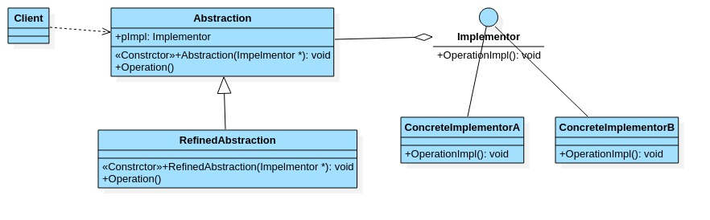
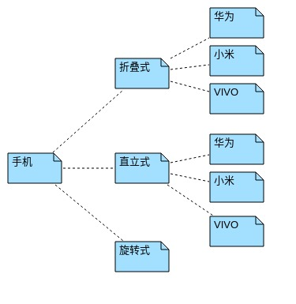
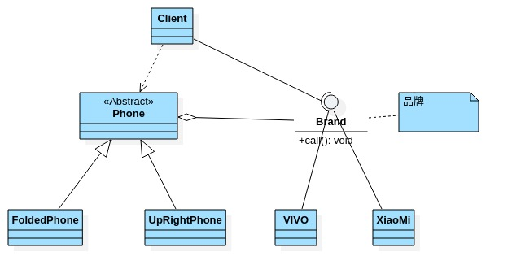

# 桥接模式

- ## 基本介绍

  1. 桥接模式(Bridge模式)是指:将实现与抽象放在两个不同的层次中,是两个层次可以独立改变.
  2. 是一种结构型模式.
  3. Bridge模式基于类的最小设计原则,通过使用封装\聚合及继承等行为让不同的类承担不同的职责.它的主要特点是把抽象(Abstraction)与行为实现(Implementation)分离开来,从而可以保持各部分的独立性以及应对他们的功能扩展.
  4. 常用的场景如类爆炸问题.

- ## 原理类图

  

  原理类图说明:

  1. Client类:桥接模式的调用者.
  2. 抽象类(Abstraction):维护了Implementor/即它的实现类,ConcreteImplementorA\ConcreteImplementorB,二者是聚合关系,Abstraction充当桥接类.
  3. RefinedAbstraction:是Abstraction抽象类的子类.
  4. Implementor:行为实现类的接口.
  5. ConcreteImplementorA\ConcreteImplementorB:行为的具体实现类.
  6. 从UML图:这里的抽象类和接口是聚合关系,其实调用和被调用关系.

- ## 桥接模式解决手机操作问题

  利用桥接模式让程序具有好的扩展性

  

- ## 桥接模式手机操作类图

  

- ## 桥接模式案例

  ```java
  package com.xie.bridge;
  
  //品牌
  public interface Brand {
      //开机
      void open();
      //关机
      void close();
      //打电话
      void call();
  }
  
  ```

  ```java
  package com.xie.bridge;
  
  public class Vivo implements Brand {
      @Override
      public void open() {
          System.out.println("VIVO 手机开机");
      }
  
      @Override
      public void close() {
          System.out.println("VIVO 手机关机");
      }
  
      @Override
      public void call() {
          System.out.println("VIVO 手机打电话");
  
      }
  }
  
  ```

  ```java
  package com.xie.bridge;
  
  public class XiaoMi implements Brand {
      @Override
      public void open() {
          System.out.println("小米手机开机");
      }
  
      @Override
      public void close() {
          System.out.println("小米手机关机");
      }
  
      @Override
      public void call() {
          System.out.println("小米手机打电话");
      }
  }
  
  ```

  ```java
  package com.xie.bridge;
  
  public abstract class Phone {
      //组合品牌
      private Brand brand;
  
      //构造器
      public Phone(Brand brand) {
          this.brand = brand;
      }
  
      protected void open() {
          brand.open();
      }
  
      protected void close() {
          brand.close();
      }
  
      protected void call() {
          brand.call();
      }
  
  }
  
  ```

  ```java
  package com.xie.bridge;
  
  public class FoldedPhone extends Phone {
      //构造器
      public FoldedPhone(Brand brand) {
          super(brand);
      }
  
      public void open() {
          super.open();
          System.out.println("折叠样式手机");
      }
      public void close() {
          super.close();
          System.out.println("折叠样式手机");
      }
      public void call() {
          super.call();
          System.out.println("折叠样式手机");
      }
  }
  
  ```

  ```java
  package com.xie.bridge;
  
  public class UpRightPhone extends Phone {
      public UpRightPhone(Brand brand) {
          super(brand);
      }
      public void open() {
          super.open();
          System.out.println("直立式手机");
      }
      public void close() {
          super.close();
          System.out.println("直立式手机");
      }
      public void call() {
          super.call();
          System.out.println("直立式手机");
      }
  }
  
  ```

  ```java
  package com.xie.bridge;
  
  public class Client {
      public static void main(String[] args) {
          //获取折叠式手机(样式+品牌)
          Phone phone = new FoldedPhone(new XiaoMi());
          phone.open();
          phone.call();
          phone.close();
      }
  }
  
  ```

- ## 桥接模式的注意事项和细节

  1. 实现了抽象和实现的部分的分离,从而极大的提供系统的灵活性,让抽象和实现部分独立开来,这有助于系统进行分层设计,从而产生更好的结构化系统.
  2. 对于系统的高层部分,只需要知道抽象部分和实现部分的接口就可以了,其他部分由具体业务来完成.
  3. 桥接模式替代多层继承方案,可以减少子类的个数,降低系统的管理和维护成本.
  4. 桥接模式的引入增加了系统的理解和设计难度,由于聚合关联关系建立在抽象层,要求开发者针对抽象进行编程.
  5. 桥接模式要求正确识别出系统中两个独立变化的维度,因此其使用范围有一定的局限性,即需要有这样的应用场景.

- ## 桥接模式其他应用场景

  1. 对于那些不希望使用继承或因为多层继承导致系统类的个数急剧增加的系统,桥接模式尤为适用.

  2. 常见的应用场景:

     - JDBC驱动程序

     - 银行转账系统

       转账分类:网上转账,柜台转账,ATM转账

       转账用户类型:普通用户,银卡用户,金卡用户

     - 消息管理

       消息类型:即时消息,延迟消息

       消息分类:手机短信,邮件消息,QQ消息
