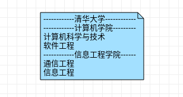
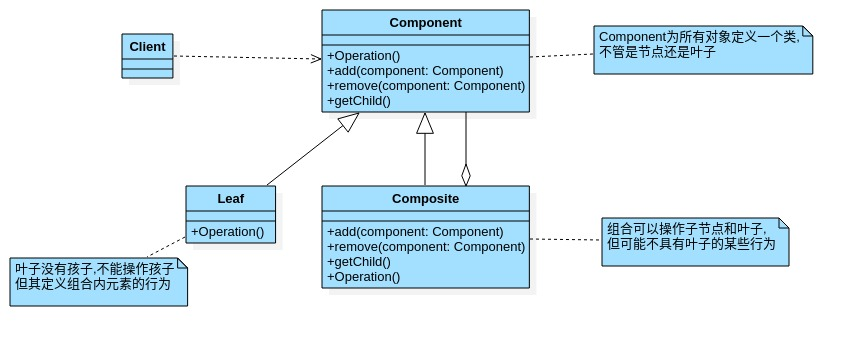
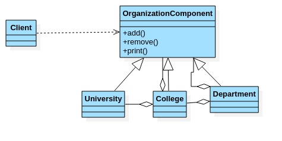

# 组合模式

- ## 一个学校院系展示需求

  编写程序展示一个学校院系结构:需求是这样的,要在一个页面中展示出学校的院系组成,一个学校有多个学院,一个学院有多个系.如图:

  

- ## 组合模式基本介绍

  1. 组合模式(Composite Pattern),又叫部分整体模式,它创建了对象组的树形结构,将对象组合成树状结构以表示"整体-部分"的层次关系.
  2. 组合模式依据树形结构来组合对象,用来表示部分以及整体层次.
  3. 这种类型的设计模式属于结构型模式.
  4. 组合模式使得用户对单个对象和组合对象的方位具有一致性,即:组合能让客户以一致的方式处理个别对象以及组合对象.

- ## 组合模式原理类图

  

  原理结构图说明:

  1. Component:这是组合中对象申明接口,在适当情况下,实现所有类共有的接口默认行为,用于访问和管理Component子部件,Component可以是抽象类或者接口.
  2. Leaf:组合中表示叶子节点,叶子节点没有子节点.
  3. Composite:非叶子节点,用于存储子部件,在Component接口中实现子部件的相关操作,比如增加add,删除remove.

- ## 解决的问题

  组合模式解决这样的问题,当我们的要处理的对象可以生成一颗树形结构,而我们要对树上的节点和叶子进行操作时,它能够提供一致的方式,而不用考虑它是节点还是叶子.

- ## 需求解决UML图

  

- ## 代码案例

  ```java
  package com.xie.composite;
  
  public abstract class OrganizationComponent {
      //名字
      private String name;
      //说明
      private String desc;
  
      public OrganizationComponent(String name, String desc) {
          this.name = name;
          this.desc = desc;
      }
  
      protected void add(OrganizationComponent organizationComponent) {
          //默认实现
          throw new UnsupportedOperationException();
      }
      protected void remove(OrganizationComponent organizationComponent) {
          //默认实现
          throw new UnsupportedOperationException();
      }
  
      public String getName() {
          return name;
      }
  
      public void setName(String name) {
          this.name = name;
      }
  
      public String getDesc() {
          return desc;
      }
  
      public void setDesc(String desc) {
          this.desc = desc;
      }
  
      //方法print,做成抽象的,子类实现
      protected abstract void print();
  }
  
  ```

  ```java
  package com.xie.composite;
  
  import java.util.ArrayList;
  import java.util.List;
  
  //University 就是composite,可以管理College
  public class University extends OrganizationComponent {
      List<OrganizationComponent> organizationComponents = new ArrayList<>();
  
      //构造器
      public University(String name, String desc) {
          super(name, desc);
      }
  
      @Override
      protected void add(OrganizationComponent organizationComponent) {
          organizationComponents.add(organizationComponent);
      }
  
      @Override
      protected void remove(OrganizationComponent organizationComponent) {
          organizationComponents.remove(organizationComponent);
      }
  
      @Override
      public String getName() {
          return super.getName();
      }
  
      @Override
      public String getDesc() {
          return super.getDesc();
      }
  
      //输出University 包含的学院
      @Override
      protected void print() {
          System.out.println("------------" + getName() + "------------");
          for (int i = 0; i < organizationComponents.size(); i++) {
              organizationComponents.get(i).print();
          }
      }
  }
  
  ```

  ```java
  package com.xie.composite;
  
  import java.util.ArrayList;
  import java.util.List;
  
  public class College extends OrganizationComponent {
      List<OrganizationComponent> organizationComponents = new ArrayList<>();
      public College(String name, String desc) {
          super(name, desc);
      }
  
      @Override
      protected void add(OrganizationComponent organizationComponent) {
          organizationComponents.add(organizationComponent);
      }
  
      @Override
      protected void remove(OrganizationComponent organizationComponent) {
          organizationComponents.remove(organizationComponent);
      }
  
      @Override
      public String getName() {
          return super.getName();
      }
  
      @Override
      public String getDesc() {
          return super.getDesc();
      }
  
      @Override
      protected void print() {
          System.out.println("------------" + getName() + "------------");
          for (int i = 0; i < organizationComponents.size(); i++) {
              organizationComponents.get(i).print();
          }
      }
  }
  
  ```

  ```java
  package com.xie.composite;
  
  public class Department extends OrganizationComponent {
      public Department(String name, String desc) {
          super(name, desc);
      }
  
      @Override
      public String getName() {
          return super.getName();
      }
  
      @Override
      public String getDesc() {
          return super.getDesc();
      }
  
      @Override
      protected void print() {
          System.out.println(getName());
      }
  }
  
  ```

  ```java
  package com.xie.composite;
  
  public class Client {
      public static void main(String[] args) {
          //从大到小创建对象
          OrganizationComponent university = new University("清华大学", "中国顶级大学");
  
          //创建学院
          OrganizationComponent computerCollege =  new College("计算机学院","计算机学院");
          OrganizationComponent infoEngineerCollege =  new College("信息工程学院","信息工程学院");
  
          //创建各个学院下的系
          computerCollege.add(new Department("软件工程","软件工程"));
          computerCollege.add(new Department("网络工程","软件工程"));
          computerCollege.add(new Department("计算机科学与技术","计算机科学与技术"));
  
  
          infoEngineerCollege.add(new Department("通信工程","通信工程"));
          infoEngineerCollege.add(new Department("信息工程","信息工程"));
  
          university.add(computerCollege);
          university.add(infoEngineerCollege);
  
          university.print();
  
      }
  }
  
  ```

- ## 组合模式注意事项

  1. 简化客户端操作.客户端只需要面对一致的对象而不用考虑整体部分或者节点叶子的问题.
  2. 具有较强的扩展性.当我们更改组合对象时,我们只需要调整内部的层次关系,客户端不用做出任何改动.
  3. 方便创建出复杂的的层次结构.客户端不用理会组合里面的组成细节,容易添加节点或者叶子从而创建出复杂的树形结构.
  4. 需要遍历组织机构,或者处理的对象具有树形结构时,非常适合使用组合模式.
  5. 要求较高的抽象性,如果节点和叶子有很多的差异性的话,比如很多方法和属性都不一样,不适合使用组合模式.
