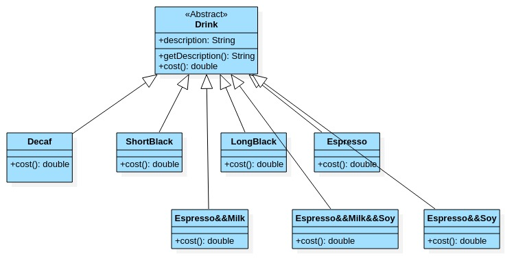
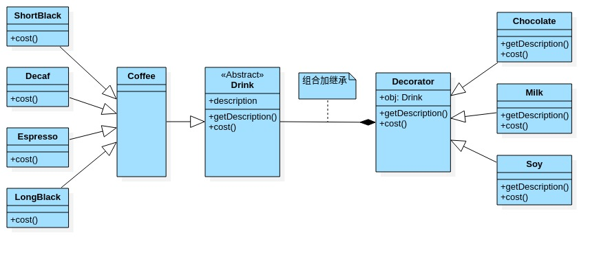

# 装饰者模式

- ## 星巴克咖啡订单项目

  1. 咖啡种类/单品咖啡:Espresso(意大利浓咖啡),ShortBlack,LongBlack(美式咖啡),Decaf(无因咖啡)
  2. 调料:Milk,Soy(豆浆),Chocolate.
  3. 要求在扩展新的咖啡种类时,具有良好的扩展性,改动方便,维护方便.
  4. 使用OO的方式计算不同种类咖啡的费用:客户可以点单品咖啡,也可以单品咖啡+调料组合.

- ## 方案1-解决星巴克咖啡订单项目

  

- ## 方案1问题分析

  1. Drink是一个抽象类,表示饮料.
  2. description就是对咖啡的描述,比如咖啡的名字.
  3. cost()方法就是自己算费用,Drink类中做成一个抽象方法.
  4. Decaf就是单品咖啡,继承Drink,并实现cost.
  5. Espresso&&Milk 就是单品咖啡加调料,这个组合很多.
  6. 问题:这样设计,会有很多类,当我们增加一个单品咖啡,或者一个新的调料,类的数量就会倍增,出现类爆炸.
  7. 使用装饰者模式.

- ## 装饰者模式定义

  1. 装饰者模式:动态将新功能附加到对象上.在对象功能扩展方面,它比继承更有弹性,装饰者模式也体现了开闭原则(COP).

- ## 装饰者模式解决星巴克咖啡订单

  

- ## 代码案例

```java
  package com.xie.decorator;
  public abstract class Drink {
      public String desc;//描述
      private float price  = 0.0f;

      public String getDesc() {
          return desc;
      }

      public void setDesc(String desc) {
          this.desc = desc;
      }

      public float getPrice() {
          return price;
      }

      public void setPrice(float price) {
          this.price = price;
      }

      //计算费用的抽象方法
      //子类来实现
      public abstract float cost();
  }
```

```java
  package com.xie.decorator;

  public class Coffee extends Drink {
      @Override
      public float cost() {
          return super.getPrice();
      }
  }
```

```java
  package com.xie.decorator;

  public class Espresso extends Coffee {
      public Espresso() {
          setDesc("意大利咖啡");
          setPrice(6.0f);
      }
  }
```

```java
  package com.xie.decorator;

  public class LongBlack extends Coffee {
      public LongBlack() {
          setDesc("美式咖啡");
          setPrice(5.0f);
      }
  }
```

```java
  package com.xie.decorator;

  public class ShortBlack extends Coffee {
      public ShortBlack() {
          setDesc("ShortBlack");
          setPrice(4.0f);
      }
  }
```

```java
  package com.xie.decorator;

  public class Decorator extends Drink {
      private Drink obj;

      public Decorator(Drink obj) {//组合
          this.obj = obj;
      }

      @Override
      public float cost() {
          //getPrice 自己的价格
          return super.getPrice() + obj.cost();
      }

      @Override
      public String getDesc() {
          //obj.getDesc() 输出被装饰者信息
          return super.desc + " " + super.getPrice() + "&&" + obj.getDesc();
      }
  }
```

```java
  package com.xie.decorator;

  //具体的Decorator ,这里就是具体的调味品
  public class Chocolate extends Decorator {
      public Chocolate(Drink obj) {
          super(obj);
          setDesc("巧克力");
          setPrice(3.0f);//调味品的价格
      }

  }
```

```java
  package com.xie.decorator;

  public class Milk extends Decorator {
      public Milk(Drink obj) {
          super(obj);
          setDesc("牛奶");
          setPrice(2.0f);
      }
  }
```

```java
  package com.xie.decorator;

  public class Soy extends Decorator {
      public Soy(Drink obj) {
          super(obj);
          setDesc("豆浆");
          setPrice(1.5f);
      }
  }
```

```java
  package com.xie.decorator;

  public class CoffeeBar {
      public static void main(String[] args) {
          //装饰者模式下订单:2份巧克力+一份牛奶的LongBlack

          //1.点一份LongBlack
          Drink order = new LongBlack();
          System.out.println("费用=" + order.cost());
          System.out.println("描述="+order.getDesc());

          //2.order 加入一份牛奶
          order = new Milk(order);
          System.out.println("order 加入一份牛奶 费用=" + order.cost());
          System.out.println("order 加入一份牛奶 描述="+order.getDesc());

          //3.order 加入一份巧克力
          order = new Chocolate(order);
          System.out.println("order 加入一份牛奶 加入一份巧克力 费用=" + order.cost());
          System.out.println("order 加入一份牛奶 加入一份巧克力 描述="+order.getDesc());

          //4.order 加入一份巧克力
          order = new Chocolate(order);
          System.out.println("order 加入一份牛奶 加入2份巧克力 费用=" + order.cost());
          System.out.println("order 加入一份牛奶 加入2份巧克力 描述="+order.getDesc());

      }
  }
```
