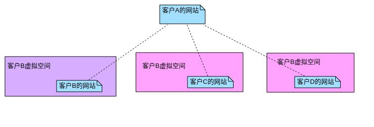
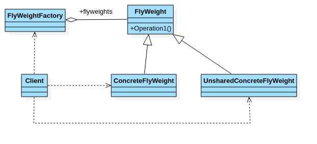
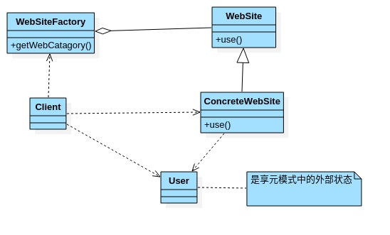

# 享元模式

- ## 展示网站项目需求

  小型的外包项目,给客户A做一个产品展示网站,客户A的朋友感觉效果不错,也希望做一个注这样的产品展示网站,但是要求有些不同.

  1. 有客户要求以新闻的形式发布.
  2. 有客户要求以博客的形式发布.
  3. 有客户希望以微信公众号的形式发布.

- ## 传统方案解决网站展示项目

  1. 直接复制一份,然后根据客户不同要求,进行定制修改.

  2. 给每个网站租用一个空间.

  3. 方案设计示意图.

    

- ## 传统方案问题分析

  1. 需要的网站结构相似度很高,而且都不是高访问量的网站,如果分成多个虚拟空间来处理,相当于同一个网站的实例对象很多,造成服务器的资源浪费.
  2. 解决思路:整合到一个网站中,共享其相关的代码和数据,对于硬盘,内存,CPU,数据库空间等服务器资源都可以达到共享,减少服务器资源.
  3. 对于代码来说,由于是一份实例,维护和扩展更加容易.
  4. 上面的解决思路就可以使用享元模式来解决.

- ## 享元模式基本介绍

  1. 享元模式(Flyweight Pattern),运用共享技术有效地支持大量的细粒度的对象.
  2. 常用于底层开发,解决系统性能问题.像数据库连接池,里面都是创建好的对象,在这些连接对象中有我们需要的则直接拿来用,避免重新创建,如果没有我们需要的,则创建一个.
  3. 享元模式能够解决重复对象的内存浪费问题,当系统中有大量相似对象,需要缓冲池时,不需要总是创建新对象,可以从缓冲池拿,这样可以降低系统内存,同时提高效率.
  4. 享元模式经典的应用场景就是池技术了,String常量池,数据库连接池,缓冲池等等都是享元模式的应用,享元模式是池技术的重要实现方式.

- ## 享元模式原理类图

  

  原理类图角色说明:

  1. FlyWeight:是一个抽象的享元角色,它是产品的抽象类,同时定义出对象的外部状态和内部状态(后面介绍)的接口或实现.
  2. ConcreteFlyWeight:是具体的享元角色,是具体的产品类,实现抽象角色定义相关业务.
  3. UnsharedConcreteFlyWeight:是不可共享的角色,一般不会出现在享元工厂.
  4. FlyWeightFactory:享元工厂,用于构建一个池容器(集合),同时提供从池中获取对象方法.

- ## 内部状态与外部状态

  比如围棋,五子棋,跳棋,它们都有大量的棋子对象,围棋和五子棋只有黑白两色,跳棋颜色多一点,所以棋子颜色就是棋子的内部状态,而各个棋子之间的差别就是位置不同,当我们落子后,落子颜色是定的,但位置是变化的,所以棋子坐标就是棋子的外部状态.

  1. 享元模式提出了两个要求:细粒度和共享对象.这里涉及到内部状态和外部状态了,即将对象的信息分成两部分:内部状态和外部状态.
  2. **内部状态**是指对象共享出来的信息,存储在享元对象内部且不会随环境的改变而改变.
  3. **外部状态**是指对象得以依赖的一个标记,是随环境改变而改变,不可共享的状态.

- ## 享元模式解决网站展示问题

  

- ## 代码案例

  ```java
  package com.xie.flyweight;
  
  public abstract class WebSite {
      public abstract void use(User user);
  }
  
  ```

  ```java
  package com.xie.flyweight;
  
  public class ConcreteWebSite extends WebSite {
      //网站发布形式,共享的部分,内部状态
      private String type;
  
      public ConcreteWebSite(String type) {
          this.type = type;
      }
  
      @Override
      public void use(User user) {
          System.out.println("网站的发布形式:" + type + " ... 使用者是" + user.getName());
      }
  }
  
  ```

  ```java
  package com.xie.flyweight;
  
  public class User {
      private String name;
  
      public User(String name) {
          this.name = name;
      }
  
      public String getName() {
          return name;
      }
  
      public void setName(String name) {
          this.name = name;
      }
  }
  
  ```

  ```java
  package com.xie.flyweight;
  
  import java.util.HashMap;
  import java.util.Map;
  
  //网站工厂类,根据需求返回一个具体的网站
  public class WebSiteFactory {
      //集合,充当池
      private Map<String, ConcreteWebSite> pool = new HashMap<>();
  
      //根据网站的类型,返回一个网站,如果没有就创建一个网站,并放入池中,并返回
      public WebSite getWebSiteCategory(String type) {
          if (!pool.containsKey(type)) {
              //就创建一个网站,并放入池中.
              pool.put(type, new ConcreteWebSite(type));
          }
          return (WebSite) pool.get(type);
      }
  
      //获取网站分类的总数(池中有多少个网站类型)
      public int getWebSiteCount() {
          return pool.size();
      }
  }
  
  ```

  ```java
  package com.xie.flyweight;
  
  public class Client {
      public static void main(String[] args) {
          //创建一个工厂
          WebSiteFactory webSiteFactory = new WebSiteFactory();
  
          //客户要以新闻形式发布网站
          WebSite site = webSiteFactory.getWebSiteCategory("新闻");
          site.use(new User("tom"));
  
          //客户要以博客形式发布网站
          WebSite site1 = webSiteFactory.getWebSiteCategory("博客");
          site1.use(new User("Jack"));
  
          //客户要以博客形式发布网站
          WebSite site2 = webSiteFactory.getWebSiteCategory("博客");
          site2.use(new User("king"));
  
          System.out.println("网站的分类共" + webSiteFactory.getWebSiteCount() + "个");
  
      }
  }
  
  ```

- ## 享元模式注意事项

  1. 在享元模式这样理解,"享"就表示共享,"元"就表示对象,共享对象.
  2. 系统中有大量对象,这些对象消耗大量内存,并且对象的状态大部分可以外部化时,我们就可以考虑选用享元模式.
  3. 用唯一标识码判断,如果在内存中有,则返回这个唯一标识码所标识的对象,用HashMap/HashTable存储.
  4. 享元模式大大减少了对象的创建,降低了程序内存的占用,提高效率.
  5. 享元模式提高了系统的复杂度.需要分离出内部状态和外部状态,而内部状态具有固化性,不应该随着外部状态的改变而改变,这是使用享元模式需要注意的地方.
  6. 使用享元模式时,注意划分内部状态和外部状态,并且需要有一个工厂类加以控制.
