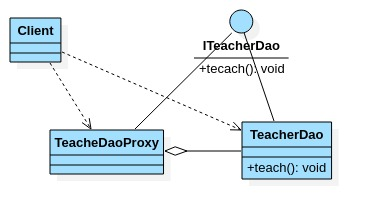
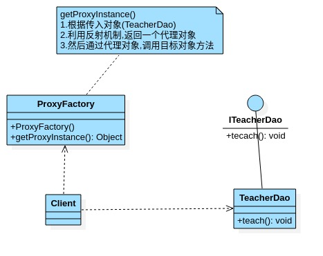
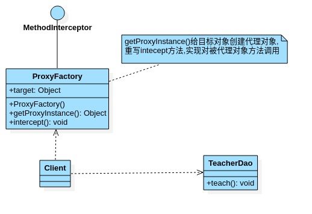

# 代理模式

- ## 基本介绍

  1. 代理模式:为一个对象提供一个替身,以控制对这个对象的访问.即通过代理对象访问目标对象.这样做的好处是:可以在目标对象实现的基础上,增强额外的功能操作,即扩展目标对象的功能.
  2. 被代理的对象可以是远程对象,创建开销大的对象或需要安全控制的对象.
  3. 代理模式有不同的形式,主要有三种静态代理,动态代理(JDK代理\接口代理)和Cglib代理(可以在内存中动态的创建对象,而不需要实现接口,它是属于动态代理的范畴).

- ## 静态代理介绍

  静态代理在使用时,需要定义接口或者父类,被代理对象(即目标对象)与代理对象一起实现相同的接口或者继承相同的父类.

  **应用实例**

  1. 定义一个接口:ITeacherDao.
  2. 目标对象TeacherDao实现接口ITeacherDao.
  3. 使用静态代理方式,就需要在代理对象TeacherDaoProxy中也实现ITeacherDao
  4. 调用的时候通过调用代理对象的方法来调用目标对象.
  5. **特别提醒**:代理对象与目标对象实现相同的接口,然后通过调用相同的方法来调用目标对象方法.

- ## 静态代理类图

  

- ## 静态代理案例

  ```java
  package com.xie.proxy;
  
  //接口
  public interface ITeacherDao {
      void teach();//授课的方法
  }
  
  ```

  ```java
  package com.xie.proxy;
  
  public class TeacherDao implements ITeacherDao {
      @Override
      public void teach() {
          System.out.println("老师授课中...");
      }
  }
  
  ```

  ```java
  package com.xie.proxy;
  
  //代理对象,静态代理
  public class TeacherDaoProxy implements ITeacherDao {
      private ITeacherDao target;//目标对象,通过接口来聚合
  
      //构造器
      public TeacherDaoProxy(ITeacherDao target) {
          this.target = target;
      }
  
      @Override
      public void teach() {
          System.out.println("开始代理...");
  
          target.teach();
  
          System.out.println("提交...");
      }
  }
  
  ```

  ```java
  package com.xie.proxy;
  
  public class Client {
      public static void main(String[] args) {
          //目标对象
          ITeacherDao teacherDao = new TeacherDao();
          //创建代理对象,同时将目标对象传递给代理对象.
          TeacherDaoProxy teacherDaoProxy = new TeacherDaoProxy(teacherDao);
          //通过代理对象调用目标对象方法.
          teacherDaoProxy.teach();
      }
  }
  
  ```

- ## 静态代理优缺点

  1. 优点:在不修改目标对象的功能前提下,能通过代理目标对象对目标功能扩展.
  2. 缺点:因为代理对象与目标对象实现一样的接口,所以会有很多代理类.
  3. 一旦接口增加方法,目标对象与代理对象都要维护.

- ## 动态代理介绍

  1. 代理对象,不需要实现接口,但是目标对象要实现接口,否则不能用动态代理

  2. 代理对象的生成,是利用JDK的API,动态的内存中构建对象.

  3. 动态代理也叫做:JDK代理,接口代理.

     JDK中生成代理对象的API:

     1. 代理类所在包:java.lang.reflect.Proxy.
     2. JDK实现代理只需要使用newProxyInstance方法,但是该方法需要接口三个参数,完整的写法是:static Object newProxyInstance(ClassLoader loader,Class<?>[]interfaces,InvocationHandler h).

- ## 动态代理类图

  

- ## 动态代理案例

  ```java
  package com.xie.proxy;
  
  import java.lang.reflect.InvocationHandler;
  import java.lang.reflect.Method;
  import java.lang.reflect.Proxy;
  
  public class ProxyFactory {
      //维护一个目标对象
      private Object target;
  
      //构造器,对target进行初始化
      public ProxyFactory(Object target) {
          this.target = target;
      }
  
      //给目标对象生成一个代理对象.
      public Object getProxyInstance(){
          //说明:
          /*
          * public static Object newProxyInstance(ClassLoader loader,
                                            Class<?>[] interfaces,
                                            InvocationHandler h)
              1.ClassLoader loader :指定当前目标对象使用的类加载器,获取加载器的方法固定
              2.Class<?>[] interfaces :目标对象实现的接口类型,使用泛型方法确认类型
              3.InvocationHandler h :事件处理,执行目标对象的方法时,会触发事件处理器方法,
                会把当前执行的目标对象方法作为参数传入.
           */
          return Proxy.newProxyInstance(target.getClass().getClassLoader(), target.getClass().getInterfaces(), new InvocationHandler() {
              @Override
              public Object invoke(Object proxy, Method method, Object[] args) throws Throwable {
                  System.out.println("JDK代理开始");
                  //反射机制调用目标对象的方法.
                  Object object = method.invoke(target, args);
                  return object;
              }
          });
      }
  }
  
  ```

  ```java
  package com.xie.proxy;
  
  public class Client {
      public static void main(String[] args) {
          //创建目标对象
          ITeacherDao target = new TeacherDao();
  
          //给目标对象,创建代理对象.
          ProxyFactory proxyFactory = new ProxyFactory(target);
          ITeacherDao proxyInstance = (ITeacherDao) proxyFactory.getProxyInstance();
  
          //proxyInstance = class com.sun.proxy.$Proxy0  内存中动态生成了代理对象
          System.out.println("proxyInstance = " + proxyInstance.getClass());
          proxyInstance.teach();
      }
  }
  ```

- ## Cglib代理介绍

  1. 静态代理和JDK代理模式都要目标对象是实现一个接口,但是有时候目标对象只是一个单独的对象,并没有实现任何的接口,这个时候可使用目标对象子类来实现代理-这就是Cglib代理.
  2. Cglib代理也叫做子类代理,它是内存中构建一个子类对象从实现目标对象功能扩展,有些书也将Cglib代理归属到动态代理.
  3. Cglib代理一个强大的高性能的代码生成包,它可以在运行期扩展java类与实现java接口,它广泛的被许多AOP的框架使用,例如AOP,实现方法拦截.
  4. 在AOP编程中如何选择代理模式:
     1. 目标对象需要实现接口,用JDK代理.
     2. 目标对象不需要实现接口,用Cglib代理.
  5. Cglib包的底层是通过使用字节码处理框架ASM来转换字节码并生成新的类.
  6. 在内存中动态构建子类,注意代理的类不能为final,否则报错java.lang.IllegalArgumentException.
  7. 目标对象的方法如果为final/static,那么就不会被拦截,即不会执行目标对象额外的业务方法.

- ## Cglib代理原理图

  

- ## Cglib代理案例

  ```java
  package com.xie.proxy;
  
  import net.sf.cglib.proxy.Enhancer;
  import net.sf.cglib.proxy.MethodInterceptor;
  import net.sf.cglib.proxy.MethodProxy;
  
  import java.lang.reflect.Method;
  
  public class CglibProxyFactory implements MethodInterceptor {
      //维护一个目标对象
      private Object target;
  
      //构造器,传入被代理的对象
      public CglibProxyFactory(Object target) {
          this.target = target;
      }
  
      //返回代理对象,是target的代理对象
      public Object getProxyInstance() {
          //1.创建一个工具类
          Enhancer enhancer = new Enhancer();
          //2.设置父类
          enhancer.setSuperclass(target.getClass());
          //3.设置回调函数
          enhancer.setCallback(this);
          //4.创建子类对象,即代理对象
          return enhancer.create();
      }
  
      //重写intercept方法,会调用目标对象的方法
      @Override
      public Object intercept(Object o, Method method, Object[] objects, MethodProxy methodProxy) throws Throwable {
          System.out.println("Cglib代理模式~~开始");
          Object invoke = method.invoke(target, objects);
          return invoke;
      }
  }
  
  ```

  ```java
  package com.xie.proxy;
  
  public class Client {
      public static void main(String[] args) {
          //创建目标对象
          ITeacherDao target = new TeacherDao();
  
          //给目标对象,创建代理对象.
          CglibProxyFactory cglibProxyFactory = new CglibProxyFactory(target);
  
          //cglibProxyFactory = class com.xie.proxy.CglibProxyFactory 内存中动态生成了代理对象
          System.out.println("cglibProxyFactory = " + cglibProxyFactory.getClass());
          TeacherDao proxyInstance = (TeacherDao) cglibProxyFactory.getProxyInstance();
          proxyInstance.teach();
      }
  }
  ```

- ## 代理模式的变体

  1. **防火墙代理**:内网通过代理穿透防火墙,实现对公网的访问.
  2. **缓存代理**:比如,当请求图片文件等资源时,先到缓存代理取,如果取到资源则OK,如果取不到资源,再到公网或者数据库取,然后缓存.
  3. **远程代理**:远程对象的本地代表,通过它可以把**远程对象当本地对象**来调用.远程代理通过网络和真正的远程对象沟通信息.
  4. **同步代理**:主要使用在多线程编程中,完成多线程间同步工作.
