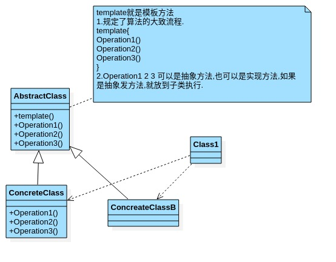
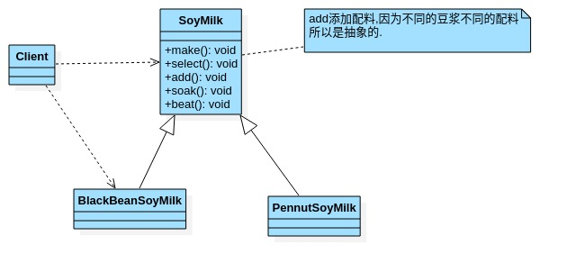

# 模板方法模式

- ## 豆浆制作问题

  编写制作豆浆程序,说明如下:

  1. 制作豆浆的流程:选材-->添加配料-->浸泡-->放到豆浆机打碎.
  2. 通过添加不同的配料,可以制作出不同口味的豆浆.
  3. 选材\浸泡和放到豆浆机打碎这几个步骤对于制作每种口味的豆浆都是一样的.
  4. 请使用**模板方法模式**完成.

- ## 基本介绍

  1. 模板方法(Template Method Pattern),又叫模板模式,在一个抽象类公开定义了执行它的方法的模板.它的子类可以按需重写方法实现,但调用将以抽象中定义的方式进行.
  2. 简单说,**模板方法模式**定义一个操作中的算法的骨架,而将一些步骤延迟到子类中,使得子类可以不改变一个算法的结构,就可以重新定义该算法的某些特定步骤.
  3. 这种类型的设计模式属于行为型模式.

- ## 原理类图

  

  类图说明:

  1. AbstractClass 抽象类,类中实现类模板方法,定义了算法的骨架,具体子类需要去实现其他抽象方法.
  2. ConcreteClass实现了抽象方法,以完成算法中特定子类的相关步骤.

- ## 制作豆浆类图

  

- ## 模板方法案例

  ```java
  package com.xie.template;
  
  //表示豆浆
  public abstract class SoyMilk {
      //模板方法,make,模板方法可以final,不让子类去覆盖.
      final void make(){
          select();
          addCondiments();
          soak();
          beat();
      }
  
      //选材料
      void select(){
          System.out.println("第一步:选择好的新鲜的黄豆");
      }
  
      //添加不同的配料,抽象方法,子类具体实现
      abstract void addCondiments();
  
      //浸泡
      void soak(){
          System.out.println("第三步:黄豆和配料开始浸泡");
      }
  
      void beat(){
          System.out.println("第四步:黄豆和配料放到豆浆机打碎");
      }
  }
  
  ```

  ```java
  package com.xie.template;
  
  public class RedBeanSoyMilk extends SoyMilk {
      @Override
      void addCondiments() {
          System.out.println("第二步:加入上好的红豆");
      }
  }
  
  ```

  ```java
  package com.xie.template;
  
  public class PeannutSoyMilk extends SoyMilk  {
      @Override
      void addCondiments() {
          System.out.println("第二步:加入上好的花生");
      }
  }
  
  ```

  ```java
  package com.xie.template;
  
  public class Client {
      public static void main(String[] args) {
           //制作红豆豆浆
          System.out.println("-----制作红豆豆浆-----");
          SoyMilk redBeanSoyMilk = new RedBeanSoyMilk();
          redBeanSoyMilk.make();
  
          //制作花生豆浆
          System.out.println("-----制作花生豆浆-----");
          SoyMilk peannutSoyMilk = new PeannutSoyMilk();
          peannutSoyMilk.make();
      }
  }
  
  ```

- ## 模板方法模式的钩子方法

  1. 在模板方法模式的父类中,我们可以定义一个方法,它默认不做任何事,子类可以视情况要不要覆盖它,该方法称为"钩子".

  2. 比如我们希望制作纯豆浆,不添加任何配料,改造如下.

     ```java
     package com.xie.template;

     //表示豆浆
     public abstract class SoyMilk {
         //模板方法,make,模板方法可以final,不让子类去覆盖.
         final void make(){
             select();
             if(customWantCondiments()){
                 addCondiments();
             }
             soak();
             beat();
         }

         //选材料
         void select(){
             System.out.println("第一步:选择好的新鲜的黄豆");
         }

         //添加不同的配料,抽象方法,子类具体实现
         abstract void addCondiments();

         //浸泡
         void soak(){
             System.out.println("第三步:黄豆和配料开始浸泡");
         }

         void beat(){
             System.out.println("第四步:黄豆和配料放到豆浆机打碎");
         }

         //钩子方法,决定是否需要添加配料
         boolean customWantCondiments(){
             return true;
         }
     }

     ```

- ## 模板方法注意事项

  1. 基本思想:算法只存在于一个地方,就是父类中,容易修改.需要修改算法时,只要修改父类的模板方法或者已实现的某些步骤,子类就会继承这些修改.
  2. 实现了最大化代码复用.父类的模板方法和已经实现的某些步骤会被子类继承而直接使用.
  3. 既统一了算法,也提供了很大的灵活性.父类的模板方法确保了算法的接口保持不变,同时由子类提供部分步骤的实现.
  4. 该模式的不足之处:每个不同的实现都需要一个子类实现,导致类的个数增加,使得系统更加庞大.
  5. 一般模板方法都加上final字段,防止子类重写模板方法.
  6. 模板方法使用场景:当要完成某个过程,该过程要执行一系列的步骤,这一系列的步骤基本相同,但其个别步骤在实现时可能不同,通常考虑使用模板方法来处理.
