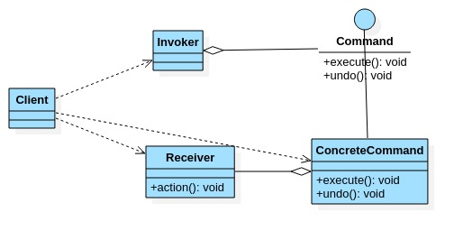
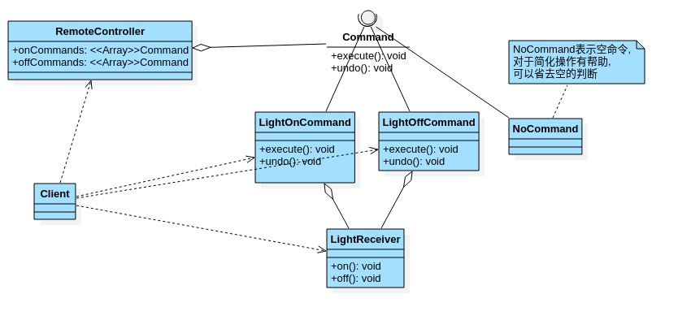

# 命令模式

- ## 基本介绍

  1. 命令模式(Command pattern):在软件设计中,我们经常需要向某些对象发送请求,但是并不知道请求的接受者是谁,也不知道被请求的操作是哪个.

     我们只需在程序运行时指定具体的请求接受者即可,此时,使用命令模式来进行设计.

  2. 命令模式使得请求发送者与请求接受者消除彼此之间的耦合,让对象之间的调用关系更加灵活,实现解耦.

  3. 在命令模式中,将一个请求封装为一个对象,以便使用不同的参数来表示不同的请求(即命令),同时命令模式也支持可撤销的操作.

  4. 通俗易懂的理解:将军发布命令,士兵去执行.其中有几个角色:将军(命令发布者),士兵(命令接受者),命令(连接将军和士兵).

     Invoker是调用者(将军),Receiver是被调用这(士兵),MyCommand是命令,实现了Command接口,持有接受对象.

- ## 命令模式原理类图

  

  原理类图说明:

  1. Invoker 是调用角色
  2. Command 是命令角色,需要执行的所有命令都在这里,可以是接口或者抽象类.
  3. Receiver:接受者角色,知道如何实施和执行一个请求的相关操作.
  4. ConcreteCommand:将一个接受者对象与一个动作,调用接受者相应的操作, 实现execute.

- ## 命令模式解决智能家电项目类图

  

- ## 代码案例

  ```java
  package com.xie.command;
  
  //创建接口命令
  public interface Command {
      //执行动作(操作)
      void execute();
  
      //撤销动作(操作)
      void undo();
  }
  
  ```

  ```java
  package com.xie.command;
  
  public class LightReceiver {
      public void on(){
          System.out.println("电灯打开");
      }
      public void off(){
          System.out.println("电灯关闭");
      }
  
  }
  
  ```

  ```java
  package com.xie.command;
  
  public class LightOnCommand implements Command {
      private LightReceiver lightReceiver;
  
      public LightOnCommand(LightReceiver lightReceiver) {
          this.lightReceiver = lightReceiver;
      }
  
      @Override
      public void execute() {
          lightReceiver.on();
      }
  
      @Override
      public void undo() {
          lightReceiver.off();
      }
  }
  
  ```

  ```java
  package com.xie.command;
  
  public class LightOffCommand implements Command {
      private LightReceiver lightReceiver;
  
      public LightOffCommand(LightReceiver lightReceiver) {
          this.lightReceiver = lightReceiver;
      }
  
      @Override
      public void execute() {
          lightReceiver.off();
      }
  
      @Override
      public void undo() {
          lightReceiver.on();
      }
  }
  
  ```

  ```java
  package com.xie.command;
  
  //没有任何命令,即空执行:用于初始化每个按钮,当调用空命令时,对象什么都不做
  //其实,这也是一种设计模式,可以省掉对空判断
  public class NoCommand implements Command {
      @Override
      public void execute() {
  
      }
  
      @Override
      public void undo() {
  
      }
  }
  
  ```

  ```java
  package com.xie.command;
  
  //遥控器
  public class RemoteController {
      //开 按钮的命令数组
      Command[] onCommands;
      Command[] offCommands;
  
      //执行撤销的命名
      Command undoCommand;
  
      //构造器,完成对按钮初始化
      public RemoteController() {
          onCommands = new Command[5];
          offCommands = new Command[5];
          for (int i = 0; i < 5; i++) {
              onCommands[i] = new NoCommand();
              offCommands[i] = new NoCommand();
          }
      }
      //给我们的按钮设置需要的命令
      public void setCommand(int no,Command onCommand,Command offCommand){
          onCommands[no] = onCommand;
          offCommands[no] = offCommand;
      }
  
      //按下开按钮
      public void onButtonWasPushed(int no){
          //找到你按下的按钮,并调用对应的方法
          onCommands[no].execute();
          //记录这次的操作,用于撤销.
          undoCommand = onCommands[no];
      }
  
      //按下关按钮
      public void offButtonWasPushed(int no){
          //找到你按下的按钮,并调用对应的方法
          offCommands[no].execute();
          //记录这次的操作,用于撤销.
          undoCommand = offCommands[no];
      }
  
      //按下撤销按钮
      public void undoButtonWasPushed(){
          undoCommand.undo();
      }
  
  }
  
  ```

  ```java
  package com.xie.command;
  
  public class Client {
      public static void main(String[] args) {
          //使用命令设计模式,完成通过遥控器,对电灯的操作.
          //创建电灯对象(接受者)
          LightReceiver lightReceiver = new LightReceiver();
  
          //创建电灯相关命令
          LightOnCommand lightOnCommand = new LightOnCommand(lightReceiver);
          LightOffCommand lightOffCommand = new LightOffCommand(lightReceiver);
  
          //需要一个遥控器
          RemoteController remoteController = new RemoteController();
          //给我们的遥控器设置命令,比如no=0  是电灯的开关操作
          remoteController.setCommand(0,lightOnCommand,lightOffCommand);
  
          System.out.println("-----按下灯开按钮------");
          remoteController.onButtonWasPushed(0);
          System.out.println("-----按下灯关按钮------");
          remoteController.offButtonWasPushed(0);
          System.out.println("-----按下撤销按钮------");
          remoteController.undoButtonWasPushed();
      }
  }
  
  ```

- ## 命令模式注意事项

  1. 将发起请求的对象与执行请求的对象解耦.发起请求的对象是调用者,调用者只要调用命令对象的execute()方法就可以让接受者工作,而不必知道具体的接受者对象是谁,是如何实现的,命令对象会负责让接受者执行请求动作,也就是说"请求发起者"和"请求执行者"之间的解耦关系是通过命令关系解耦的,命令对象起到纽带桥梁的作用.
  2. 容易设计一个命令队列.只要把命令对象放到队列,就可以多线程的执行命令.
  3. 容易实现对请求的撤销和重做.
  4. 命令模式的不足:可能导致某些系统有过多的命令类,增加系统的复杂度,这点在使用的时候要注意.
  5. 空命令也是一种设计模式,它为我们省去了判空的操作.
  6. 命令模式经典应用场景:界面的一个按钮都是一条命令,模拟CMD(DOS),订单的撤销-恢复,触发-反馈机智.
