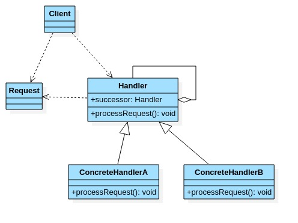
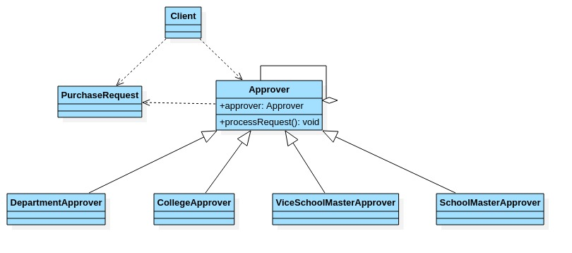

# 职责链模式

- ## OA系统采购审批

  学校OA系统的采购审批项目,需求是:

  1. 采购员采购教学器材.
  2. 如果金额x在0<x<=5000,由教学主任审批.
  3. 如果金额x在5000<x<<10000,由院长审批.
  4. 如果金额x在10000<x<=30000,由副校长审批.
  5. 如果金额x在>30000,由校长审批.

- ## 职责链模式基本介绍

  1. 职责链模式(Chain of Responsibility pattern),又叫责任链模式,为请求创建了一个**接受者对象的链**.这种模式对请求的发送者和接受者进行解耦.
  2. 职责链模式通过每个接受者都包含对另一个接受者的引用.如果一个对象不能处理该请求,那么它会把相同的请求传给下一个接受者,依次类推.
  3. 这种设计模式属于行为型模式.

- ## 原理类图

  

  使多个对象都有机会处理请求,从而避免请求的发送者和接受者之间的耦合关系.将这个对象连成一条链,并沿着这个链处理该请求,直到有一个对象处理它为止.

  类图说明:

  1. Handler:抽象的处理者,定义了一个处理请求的接口,同时含有另外Handler.
  2. ConcreteHandlerA,B:具体的处理者,处理它自己负责的请求,可以访问它的后继者(即下一个处理者),如果可以处理当前请求,则处理,否则将该请求交给后继者去处理,从而形成一个职责链.
  3. Request:含有很多属性,表示一个请求.

- ## 案例类图

  

  ```java
  package com.xie.chain;
  
  //购买请求
  public class PurchaseRequest {
      private int type = 0;//请求类型
      private float price = 0.0f;//请求的金额
      private int id = 0;
  
      public PurchaseRequest(int type, float price, int id) {
          this.type = type;
          this.price = price;
          this.id = id;
      }
  
      public int getType() {
          return type;
      }
  
      public float getPrice() {
          return price;
      }
  
      public int getId() {
          return id;
      }
  }
  
  ```

  ```java
  package com.xie.chain;
  
  public abstract class Approver {
      Approver approver;//下一处理者
      String name;//名字
  
      public Approver(String name) {
          this.name = name;
      }
  
      //下一个处理者
      public void setApprover(Approver approver) {
          this.approver = approver;
      }
  
      //处理审批请求的方法,得到一个请求,处理是子类完成,因此该方法做成抽象.
      public abstract void processRequest(PurchaseRequest request);
  }
  ```
  
  ```java
  package com.xie.chain;
  //主任审批
  public class DepartmentApprover extends Approver {
      public DepartmentApprover(String name) {
          super(name);
      }
  
      @Override
      public void processRequest(PurchaseRequest request) {
          if (request.getPrice() <= 5000) {
              System.out.println("请求编号id=" + request.getId() + "被" + this.name + "处理");
          }else {
              approver.processRequest(request);
          }
      }
  }
  
  ```
  
  ```java
  package com.xie.chain;
  //院长审批
  public class CollegeApprover extends Approver {
      public CollegeApprover(String name) {
          super(name);
      }
  
      @Override
      public void processRequest(PurchaseRequest request) {
          if (request.getPrice() > 5000 && request.getPrice() <= 10000) {
              System.out.println("请求编号id=" + request.getId() + "被" + this.name + "处理");
          }else {
              approver.processRequest(request);
          }
      }
  }
  
  ```
  
  ```java
  package com.xie.chain;
  //副校长审批
  public class ViceSchoolMasterApprover extends Approver {
      public ViceSchoolMasterApprover(String name) {
          super(name);
      }
  
      @Override
      public void processRequest(PurchaseRequest request) {
          if (request.getPrice() > 10000 && request.getPrice() <= 30000) {
              System.out.println("请求编号id=" + request.getId() + "被" + this.name + "处理");
          }else {
              approver.processRequest(request);
          }
      }
  }
  
  ```
  
  ```java
  package com.xie.chain;
  //校长审批
  public class SchoolMasterApprover extends Approver {
      public SchoolMasterApprover(String name) {
          super(name);
      }
  
      @Override
      public void processRequest(PurchaseRequest request) {
          if (request.getPrice() > 30000) {
              System.out.println("请求编号id=" + request.getId() + "被" + this.name + "处理");
          }else {
              approver.processRequest(request);
          }
      }
  }
  
  ```
  
  ```java
  package com.xie.chain;
  
  public class Client {
      public static void main(String[] args) {
          //创建请求
          PurchaseRequest purchaseRequest = new PurchaseRequest(1, 21000, 1);
  
          //创建相关的审批人
          DepartmentApprover departmentApprover = new DepartmentApprover("张主任");
          CollegeApprover collegeApprover = new CollegeApprover("李院长");
          ViceSchoolMasterApprover viceSchoolMasterApprover = new ViceSchoolMasterApprover("王副校长");
          SchoolMasterApprover schoolMasterApprover = new SchoolMasterApprover("周校长");
  
          //需要将各个审批级别的下一个设置好(处理人构成一个环形)
          departmentApprover.setApprover(collegeApprover);
          collegeApprover.setApprover(viceSchoolMasterApprover);
          viceSchoolMasterApprover.setApprover(schoolMasterApprover);
          schoolMasterApprover.setApprover(departmentApprover);
  
          schoolMasterApprover.processRequest(purchaseRequest);
      }
  }
  /*请求编号id=1被王副校长处理*/
  
  ```
  
- ## 注意事项

  1. 将请求和处理分开,实现解耦,提供系统灵活性.
  2. 简化了对象,使对象不需要知道链的结构.
  3. 性能会收到影响,特别是链比较长的时候,因此需要控制链中最大节点数量,一般通过在Handler中设置一个最大节点数量,在setNext()方法中判断是否已经超过阀值,超过则不允许该链建立,避免出现超长链无意识地破坏系统性能.
  4. 调试不方便.采用了类似递归的方式,调试时逻辑可能比较复杂.
  5. 最佳应用场景:有多个对象可以处理同一个请求时,比如多级请求,请假\加薪等审批流程,Java Web 中的tomcat对encoding的处理,拦截器.
