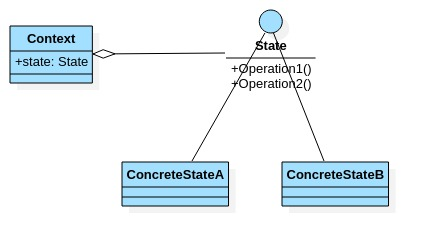
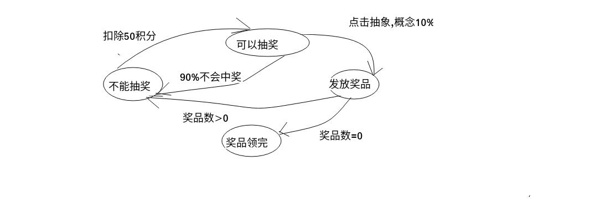
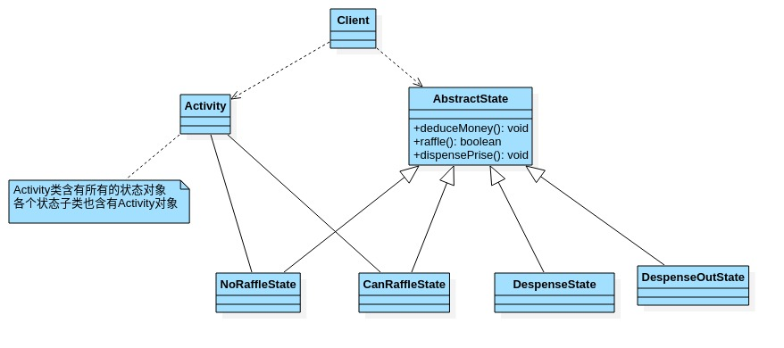

# 状态模式

- ## 基本介绍

  1. 状态模式(State pattern):它主要用来解决对象在多种状态转换时,需要对外输出不同的行为的问题.状态和行为是一一对应的,状态之间可以相互转换.
  2. 当一个对象的内在状态改变时,允许改变其行为,这个对象看起来像是改变其类.

- ## 原理类图

  

  类图说明:

  1. Context:为环境角色,用户维护State实例,这个实例定义当前的状态.
  2. State:是抽象状态角色,定义一个接口封装与Context的一个特定接口相关行为.
  3. ConcreteState:具体状态角色,每个子类实现一个与Context的一个状态相关行为.

- ## 状态模式解决APP抽奖问题

  
  
- ## 案例类图

  

- ## 代码案例

  ```java
  package com.xie.state;
  
  /**
   * 状态抽象类
   */
  public abstract class State {
      //扣除积分  - 50
      public abstract void deduceMoney();
      //是否抽中奖品
      public abstract boolean raffle();
      //发放奖品
      public abstract void dispensePrise();
  }
  
  ```

  ```java
  package com.xie.state;
  
  //不能抽奖状态
  public class NoRaffleState extends State {
      //初始化时传入活动引用,扣除积分后改变其状态
      RaffleActivity activity;
  
      public NoRaffleState(RaffleActivity activity) {
          this.activity = activity;
      }
  
      //当前状态可以扣除积分,扣除后,将状态设置成可以抽奖状态.
      @Override
      public void deduceMoney() {
          System.out.println("扣除50积分成功,您可以抽奖了");
          activity.setState(activity.getCanRaffleState());
      }
  
      //当前状态不能抽奖,
      @Override
      public boolean raffle() {
          System.out.println("扣了积分才能抽奖哦!");
          return false;
      }
  
      //当前不能发奖品
      @Override
      public void dispensePrise() {
          System.out.println("不能发放奖品");
      }
  }
  
  ```

  ```java
  package com.xie.state;
  
  import java.util.Random;
  
  /**
   * 可以抽奖状态
   */
  public class CanRaffleState extends State {
      RaffleActivity activity;
  
      public CanRaffleState(RaffleActivity activity) {
          this.activity = activity;
      }
  
      //当前状态不能扣除积分
      @Override
      public void deduceMoney() {
          System.out.println("已经扣除了积分");
      }
      //当前状态可以抽奖,抽奖后根据实际情况改成新的状态
      @Override
      public boolean raffle() {
          System.out.println("正在抽奖,请稍等!");
          Random random = new Random();
          int num = random.nextInt(10);
          //10% 中奖机会
          if (num == 0) {
              //改变活动状态为发放奖品
              activity.setState(activity.getDispenseState());
              return true;
          } else {
              System.out.println("很遗憾没有抽中奖品!");
              //改变活动状态为不能抽奖
              activity.setState(activity.getNoRaffleState());
              return false;
          }
      }
  
      //当前状态不能发放奖品
      @Override
      public void dispensePrise() {
          System.out.println("没中奖,不能发放奖品");
      }
  }
  
  ```

  ```java
  package com.xie.state;
  
  /**
   * 发放奖品状态
   */
  public class DispenseState extends State {
      RaffleActivity activity;
  
      public DispenseState(RaffleActivity activity) {
          this.activity = activity;
      }
  
      //当前状态不能扣除积分
      @Override
      public void deduceMoney() {
          System.out.println("不能扣除积分");
      }
      //当前状态不能抽奖
      @Override
      public boolean raffle() {
          System.out.println("不能抽奖");
          return false;
      }
      //当前状态可以发放奖品
      @Override
      public void dispensePrise() {
          if(activity.getCount()>0){
              System.out.println("恭喜中奖了");
              //改变状态不能抽奖
              activity.setState(activity.getNoRaffleState());
          }else{
              System.out.println("遗憾,奖品发完了");
              //改变状态为奖品发完了,后面就不可以抽奖了
              activity.setState(activity.getDispenseOutState());
          }
      }
  }
  
  ```

  ```java
  package com.xie.state;
  
  /**
   * 奖品发放完状态
   * 说明,当activity 改变成DispenseOutState,抽奖活动结束
   */
  public class DispenseOutState extends State {
      RaffleActivity activity;
  
      public DispenseOutState(RaffleActivity activity) {
          this.activity = activity;
      }
  
      //
      @Override
      public void deduceMoney() {
          System.out.println("奖品发完了,请下次再参加!");
      }
  
      @Override
      public boolean raffle() {
          System.out.println("奖品发完了,请下次再参加!");
          return false;
      }
  
      @Override
      public void dispensePrise() {
          System.out.println("奖品发完了,请下次再参加!");
      }
  }
  
  ```

  ```java
  package com.xie.state;
  
  public class RaffleActivity {
      //state 表示活动当前的状态
      State state = null;
      int count = 0;
      State noRaffleState = new NoRaffleState(this);
      State canRaffleState = new CanRaffleState(this);
      State dispenseState = new DispenseState(this);
      State dispenseOutState = new DispenseOutState(this);
  
      //构造器
      //1.初始化当前状态为 noRaffleState(即不能抽奖状态)
      public RaffleActivity(int count) {
          this.state = getNoRaffleState();
          this.count = count;
      }
  
      //扣分,当前状态的deduceMoney
      public void deduceMoney(){
          state.deduceMoney();
      }
  
      //抽奖
      public void raffle(){
          //如果当前的状态是抽奖成功,就领取奖品
          if(state.raffle()){
              state.dispensePrise();
          }
      }
      public int getCount() {
          int curCount = count;
          count--;
          return curCount;
      }
  
      public void setCount(int count) {
          this.count = count;
      }
  
      public State getState() {
          return state;
      }
  
      public void setState(State state) {
          this.state = state;
      }
  
      public State getNoRaffleState() {
          return noRaffleState;
      }
  
      public void setNoRaffleState(State noRaffleState) {
          this.noRaffleState = noRaffleState;
      }
  
      public State getCanRaffleState() {
          return canRaffleState;
      }
  
      public void setCanRaffleState(State canRaffleState) {
          this.canRaffleState = canRaffleState;
      }
  
      public State getDispenseState() {
          return dispenseState;
      }
  
      public void setDispenseState(State dispenseState) {
          this.dispenseState = dispenseState;
      }
  
      public State getDispenseOutState() {
          return dispenseOutState;
      }
  
      public void setDispenseOutState(State dispenseOutState) {
          this.dispenseOutState = dispenseOutState;
      }
  }
  
  ```
  
  ```java
  package com.xie.state;

  public class Client {
      public static void main(String[] args) {
          //创建活动对象,奖品有一个
          RaffleActivity activity = new RaffleActivity(1);
          for (int i = 0; i < 300; i++) {
              System.out.println("----------第" + (i + 1) + "此抽奖----------");
              //参加抽奖,第一步扣除积分
              activity.deduceMoney();
              //第二步,抽奖
              activity.raffle();
          }
      }
  }
  
  ```
  
- ## 注意事项
  
  1. 代码很强的可读性.状态模式将每个状态的行为封装到对应的一个类中.
  2. 方便维护.将容易产生问题的if-else语句删除了,如果把每个状态的行为都放到一个类中,每次调用方法时都要判断当前是什么状态,不但会产生很多if-else语句,而且容易出错.
  3. 符合**开闭原则**.容易增删状态.
  4. 会产生很多类.每个状态都要一个对应的类,当状态过多时会产生很多类,加大维护难度.
  5. 应用场景:当一个事件或者对象有很多种状态,状态之间会相互转换,对不同的状态要求不用的行为时,可以考虑使用状态模式.
