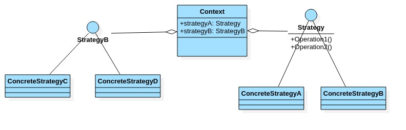
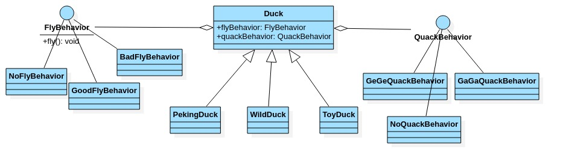

# 策略模式

- ## 基本介绍

  1. 策略模式(Strategy pattern)中,定义算法族,分别封装起来,让他们之间可以相互替换,此模式让算法的变化独立于算法的使用客户.
  2. 这个算法体现了几个设计原则,第一,**把变化的代码从不变的代码中分离出来**;第二,**针对接口编程而不是具体类(定义了策略接口)**;第三,**多用组合/聚合,少用继承(客户通过组合的方式使用策略)**.

- ## 原理类图

  

  从图中可以看到,客户Context有成员变量strategy或者其他的策略接口,至于需要使用到那些策略,可以在构造器中指定.

- ## 需求

  使用策略模式完成,不同的鸭子具有不同的行为,如鸭子种类有,野鸭,北京鸭,玩具鸭...行为有,叫,游泳,飞翔....

- ## 需求类图

  

- ## 案例代码

  ```java
  package com.xie.strategy;
  //飞行行为
  public interface FlyBehavior {
      void fly();
  }
  ```

  ```java
  package com.xie.strategy;
  
  public class GoodFlyBehavior implements FlyBehavior {
      @Override
      public void fly() {
          System.out.println("飞翔技术高超~~");
      }
  }
  
  ```

  ```java
  package com.xie.strategy;
  
  public class BadFlyBehavior implements FlyBehavior {
      @Override
      public void fly() {
          System.out.println("飞翔技术一般");
      }
  }
  
  ```

  ```java
  package com.xie.strategy;
  
  public class NoFlyBehavior implements FlyBehavior {
      @Override
      public void fly() {
          System.out.println("不会飞翔");
      }
  }
  
  ```

  ```java
  package com.xie.strategy;
  
  public abstract class Duck {
      //属性,策略接口
      FlyBehavior flyBehavior;
  
      public Duck(FlyBehavior flyBehavior) {
          this.flyBehavior = flyBehavior;
      }
  
      //显示鸭子信息
      public abstract void display();
  
      public void quack() {
          System.out.println("鸭子嘎嘎叫~~");
      }
  
      public void swim() {
          System.out.println("鸭子会游泳~~");
      }
  
      public void fly() {
          if (flyBehavior != null) {
              flyBehavior.fly();
          }
      }
  
  }
  
  ```

  ```java
  package com.xie.strategy;
  
  public class WildDuck extends Duck {
  
      public WildDuck(FlyBehavior flyBehavior) {
          super(flyBehavior);
      }
  
      @Override
      public void display() {
          System.out.println("这是野鸭");
      }
  }
  
  ```

  ```java
  package com.xie.strategy;
  
  public class PekingDuck extends Duck {
      public PekingDuck(FlyBehavior flyBehavior) {
          super(flyBehavior);
      }
  
      @Override
      public void display() {
          System.out.println("这是北京鸭");
      }
  
      @Override
      public void fly() {
          flyBehavior.fly();
      }
  }
  
  ```

  ```java
  package com.xie.strategy;
  
  public class ToyDuck extends Duck{
      public ToyDuck(FlyBehavior flyBehavior) {
          super(flyBehavior);
      }
  
      @Override
      public void display() {
          System.out.println("玩具鸭");
      }
  
      @Override
      public void fly() {
          flyBehavior.fly();
      }
  }
  
  ```

  ```java
  package com.xie.strategy;
  
  public class Client {
      public static void main(String[] args) {
          Duck wildDuck = new WildDuck(new GoodFlyBehavior());
          wildDuck.display();
          wildDuck.fly();
          Duck toyDuck = new ToyDuck(new NoFlyBehavior());
          toyDuck.display();
          toyDuck.fly();
          Duck pekingDuck = new PekingDuck(new BadFlyBehavior());
          pekingDuck.display();
          pekingDuck.fly();
      }
  }
  /*
  这是野鸭
  飞翔技术高超~~
  玩具鸭
  不会飞翔
  这是北京鸭
  飞翔技术一般
  */
  
  ```

- ## 注意事项

  1. 策略模式的关键是:分析项目中变化部分与不变部分.
  2. 策略模式核心思想是:多用组合\聚合 少用继承;用行为类组合,而不是行为的继承,更有弹性.
  3. 体现了"对修改关闭,对扩展开放"原则,客户端增加行为不用修改原有代码,只要添加一种策略(或者行为)即可,避免了使用多重转移语句(if..else..).
  4. 提供了可以替换继承关系的办法:策略模式将算法封装在独立的Strategy类中,使得你可以独立于其Context改变它,使它易于切换,易于理解,易于扩展.
  5. 需要注意的是:每添加一个策略就要增加一个类,当策略过多时会导致类数目庞大.
