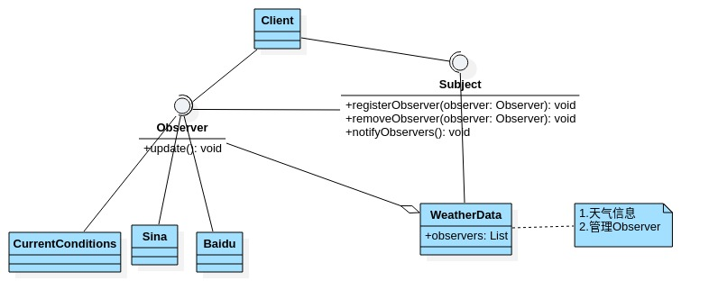

# 观察者模式

- ## 天气预报项目需求

  具体要求如下:

  1. 气象站可以将每天测量到的温度\湿度\气压等等以公告的形式发布出去(比如发布到自己的网站或第三方).
  2. 需要设计开放型API,便于其他第三方也能介入气象站获取数据.
  3. 提供温度\湿度\气压的接口.
  4. 测量数据更新时,要能实时的通知给第三方.

- ## 普通方案实现案例代码

  ```java
  package com.xie.observer;
  
  //显示当前天气情况(可以理解成气象站自己的网站)
  public class CurrentConditions {
      //温度\气压\湿度
      private float temperature;
      private float pressure;
      private float humidity;
  
      //更新天气情况,是由WeatherData调用,使用推送模式
      public void update(float temperature, float pressure, float humidity) {
          this.temperature = temperature;
          this.pressure = pressure;
          this.humidity = humidity;
          display();
      }
  
      //显示
      public void display() {
          System.out.println("***Today mTemperature :" + temperature + "***");
          System.out.println("***Today mPressure :" + pressure + "***");
          System.out.println("***Today mHumidity:" + humidity + "***");
      }
  }
  
  ```

  ```java
  package com.xie.observer;
  
  //类是核心,气象站
  //1.包含最新的天气情况信息
  //2.含有CurrentConditions对象
  //3.当数据有更新时,就主动的调用CurrentConditions对象的update方法(含display),这样他们(接入方)就看到了最新的信息
  public class WeatherData {
      private float temperature;
      private float pressure;
      private float humidity;
      private CurrentConditions currentConditions;
  
      public WeatherData(CurrentConditions currentConditions) {
          this.currentConditions = currentConditions;
      }
  
      public void dataChange() {
          //调用接入方的update方法
          currentConditions.update(getTemperature(), getPressure(), getHumidity());
      }
  
      //当数据有更新时就调用setData
      public void setData(float temperature, float pressure, float humidity) {
          this.temperature = temperature;
          this.pressure = pressure;
          this.humidity = humidity;
          dataChange();
      }
  
      public float getTemperature() {
          return temperature;
      }
  
      public void setTemperature(float temperature) {
          this.temperature = temperature;
      }
  
      public float getPressure() {
          return pressure;
      }
  
      public void setPressure(float pressure) {
          this.pressure = pressure;
      }
  
      public float getHumidity() {
          return humidity;
      }
  
      public void setHumidity(float humidity) {
          this.humidity = humidity;
      }
  }
  
  ```

  ```java
  package com.xie.observer;
  
  public class Client {
      public static void main(String[] args) {
          //创建接入方currentConditions
          CurrentConditions currentConditions = new CurrentConditions();
          //创建weatherData并将接入方currentConditions传递到weatherData中
          WeatherData weatherData = new WeatherData(currentConditions);
          //更新天气情况
          weatherData.setData(30, 150, 40);
      }
  }
  
  ```

  问题分析:

  1. 其他第三方接入气象站获取数据的问题.
  2. 无法在运行时动态的添加第三方.
  3. 违反了OCP.

- ## 观察者模式类图
  
  对象之间的多对一依赖的一种设计方案,被依赖的对象为subject,依赖的对象为observer,subject通过observer变化.

  

- ## 代码案例

  ```java
  package com.xie.observer;
  
  //观察者接口,由观察者实现
  public interface Observer {
      void update(float temperature,float pressure ,float humidity);
  }
  
  ```

  ```java
  package com.xie.observer;
  
  //接口,让WeatherData来实现
  public interface Subject {
      void registerObserver(Observer observer);
      void removeObserver(Observer observer);
      void notifyObservers();
  }
  
  ```

  ```java
  package com.xie.observer;
  
  //显示当前天气情况(可以理解成气象站自己的网站)
  public class CurrentConditions implements Observer{
      //温度\气压\湿度
      private float temperature;
      private float pressure;
      private float humidity;
  
      //更新天气情况,是由WeatherData调用,使用推送模式
      public void update(float temperature, float pressure, float humidity) {
          this.temperature = temperature;
          this.pressure = pressure;
          this.humidity = humidity;
          display();
      }
  
      //显示
      public void display() {
          System.out.println("***Today mTemperature :" + temperature + "***");
          System.out.println("***Today mPressure :" + pressure + "***");
          System.out.println("***Today mHumidity:" + humidity + "***");
      }
  }
  
  ```

  ```java
  package com.xie.observer;
  
  public class BaiduSite implements Observer {
      //温度\气压\湿度
      private float temperature;
      private float pressure;
      private float humidity;
      @Override
      public void update(float temperature, float pressure, float humidity) {
          this.temperature = temperature;
          this.pressure = pressure;
          this.humidity = humidity;
          display();
      }
      //显示
      public void display() {
          System.out.println("***百度网站 温度 :" + temperature + "***");
          System.out.println("***百度网站 气压 :" + pressure + "***");
          System.out.println("***百度网站 湿度:" + humidity + "***");
      }
  
  }
  
  ```

  ```java
  package com.xie.observer;
  
  import java.util.ArrayList;
  import java.util.List;
  
  //类是核心
  //1.包含最新的天气情况信息
  //2.含有观察者集合,使用List管理,
  //3.当数据有更新时,就主动的遍历ArrayList,这样他们(接入方)就看到了最新的信息
  public class WeatherData implements Subject{
      private float temperature;
      private float pressure;
      private float humidity;
      //观察者集合
      private List<Observer> observers;
  
      public WeatherData() {
          observers = new ArrayList<>();
      }
  
      public void dataChange() {
          //调用接入方的update方法
          notifyObservers();
      }
  
      //当数据有更新时就调用setData
      public void setData(float temperature, float pressure, float humidity) {
          this.temperature = temperature;
          this.pressure = pressure;
          this.humidity = humidity;
          dataChange();
      }
  
      //注册观察者
      @Override
      public void registerObserver(Observer observer) {
          observers.add(observer);
      }
      //移除观察者
      @Override
      public void removeObserver(Observer observer) {
          if(observers.contains(observer)){
              observers.remove(observer);
          }
      }
      //通知所有观察者
      @Override
      public void notifyObservers() {
          for (Observer observer : observers) {
              observer.update(temperature,pressure,humidity);
          }
      }
  }
  
  ```

  ```java
  package com.xie.observer;
  
  public class Client {
      public static void main(String[] args) {
          //创建一个WeatherData
          WeatherData weatherData = new WeatherData();
          //创建观察者
          CurrentConditions currentConditions = new CurrentConditions();
          BaiduSite baiduSite = new BaiduSite();
          //注册到weatherData
          weatherData.registerObserver(currentConditions);
          weatherData.registerObserver(baiduSite);
  
          System.out.println("通知各个注册的观察者,看看信息");
          weatherData.setData(10f,100f,30.3f);
      }
  }
  
  ```
