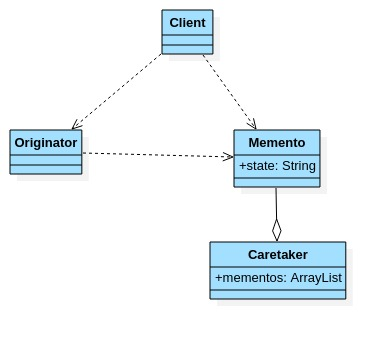
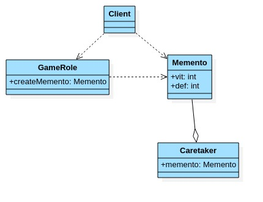

# 备忘录模式

- ## 基本介绍

  1. 备忘录(Memento Pattern)模式在不破坏封装性的前提下,捕获一个对象内的内部状态,并在该对象之外保存这个状态.这样以后就可将该对象恢复到原先保存的状态.
  2. 可以这样理解备忘录模式:现实生活中的备忘录是用来记录某些要去做的事情,或者是记录已经达成的共同意见的事情,以防忘记.而在软件层面,备忘录模式有着相同的含义,备忘录对象主要用来记录一个对象的某种状态,或者某些数据,当要退回时,可以从备忘录对象里获取原来的数据进行恢复操作.
  3. 备忘录模式属于行为型模式.

- ## 备忘录模式原理类图

  

  原理类图说明:

  1. Originator:对象(需要保存状态的对象).
  2. Memento:备忘录对象,负责保存好记录,即Originator内部状态.
  3. Caretaker:守护者对象,负责保存多个备忘录对象,使用集合管理,提高效率.
  4. 说明:如果希望保存多个Originator对象的不同时间的状态,也可以,只需要HashMap<String,集合>.

- ## 备忘录模式类图案例

  ```java
  package com.xie.memento;
  
  public class Memento {
      private String state;
  
      public Memento(String state) {
          this.state = state;
      }
  
      public String getState() {
          return state;
      }
  }
  
  ```

  ```java
  package com.xie.memento;
  
  public class Originator {
      private String state;
  
      public String getState() {
          return state;
      }
  
      public void setState(String state) {
          this.state = state;
      }
  
      //编写一个方法,可以保存一个状态对象Memento
      //因此编写一个方法,返回Memento
      public Memento saveStateMemento() {
          return new Memento(state);
      }
  
      //通过备忘录对象,恢复状态
      public void getStateFromMemento(Memento memento){
          state = memento.getState();
      }
  }
  
  ```

  ```java
  package com.xie.memento;
  
  import java.util.ArrayList;
  import java.util.List;
  
  public class Caretaker {
      //在List集中会有很多的备忘录对象
      private List<Memento> mementoList = new ArrayList<>();
  
      public void add(Memento memento) {
          mementoList.add(memento);
      }
      //获取到第index个Originator的备忘录对象(即保存的状态)
      public Memento get(int index){
          return mementoList.get(index);
      }
  }
  
  ```

  ```java
  package com.xie.memento;
  
  public class Client {
      public static void main(String[] args) {
          Originator originator = new Originator();
          Caretaker caretaker = new Caretaker();
          originator.setState("状态#1 攻击力100");
          //保存了当前的状态
          caretaker.add(originator.saveStateMemento());
  
          originator.setState("状态#2 攻击力80");
          caretaker.add(originator.saveStateMemento());
  
          originator.setState("状态#3 攻击力50");
          caretaker.add(originator.saveStateMemento());
  
  
          System.out.println("当前的状态是:" + originator.getState());
          //希望恢复到状态1,将Originator恢复到状态1
          originator.getStateFromMemento(caretaker.get(0));
          System.out.println("恢复后的状态是:" + originator.getState());
      }
  }
  /*
  当前的状态是:状态#3 攻击力50
  恢复后的状态是:状态#1 攻击力100
  * */
  
  ```

- ## 游戏角色恢复状态实例

  游戏角色有攻击力和防御力,在大战boss前保存自身的状态(攻击力和防御力),在大战Boss后攻击力和防御力下降,从备忘录对象恢复到大战前的状态.

- ## 实例类图

  

- ## 实例案例

  ```java
  package com.xie.memento.game;
  
  public class Memento {
      //攻击力
      private int vit;
      //防御力
      private int def;
  
      public Memento(int vit, int def) {
          this.vit = vit;
          this.def = def;
      }
  
      public int getVit() {
          return vit;
      }
  
      public void setVit(int vit) {
          this.vit = vit;
      }
  
      public int getDef() {
          return def;
      }
  
      public void setDef(int def) {
          this.def = def;
      }
  }
  
  ```

  ```java
  package com.xie.memento.game;
  
  import java.util.List;
  import java.util.Map;
  
  //守护者对象,保存游戏角色的状态,
  public class Caretaker {
      //如果只保存一次状态
      private Memento memento;
  
      //对GameRole保存多次状态
      //private List<Memento> mementos;
      //对多个游戏角色保存多个状态
      //private Map<String,List<Memento>> rolesMementos;
  
      public Memento getMemento() {
          return memento;
      }
  
      public void setMemento(Memento memento) {
          this.memento = memento;
      }
  }
  
  ```

  ```java
  package com.xie.memento.game;
  
  import javax.crypto.spec.PSource;
  
  public class GameRole {
      //攻击力
      private int vit;
      //防御力
      private int def;
  
      //创建Memento,即根据游戏角色当前的状态得到Memento
      public Memento createMemento() {
          return new Memento(vit, def);
      }
  
      //从备忘录对象恢复GameRole
      public void recoverGameRoleFromMemento(Memento memento) {
          this.vit = memento.getVit();
          this.def = memento.getDef();
      }
  
      //显示当前游戏角色状态
  
      public void display() {
          System.out.println("游戏角色当前的攻击力:" + this.vit + ",防御力:" + this.def);
      }
  
      public int getVit() {
          return vit;
      }
  
      public int getDef() {
          return def;
      }
  
      public void setVit(int vit) {
          this.vit = vit;
      }
  
      public void setDef(int def) {
          this.def = def;
      }
  }
  
  ```

  ```java
  package com.xie.memento.game;
  
  public class Client {
      public static void main(String[] args) {
          //创建游戏角色
          GameRole gameRole = new GameRole();
          gameRole.setVit(100);
          gameRole.setDef(100);
  
          System.out.println("和Boss大战前的状态~~");
          gameRole.display();
  
          //把当前的状态保存到Caretaker
          Caretaker caretaker = new Caretaker();
          caretaker.setMemento(gameRole.createMemento());
  
          System.out.println("和Boss大战~~");
          gameRole.setVit(30);
          gameRole.setDef(30);
          gameRole.display();
  
          System.out.println("大战后,使用备忘录对象恢复到大战前状态~~");
          gameRole.recoverGameRoleFromMemento(caretaker.getMemento());
          gameRole.display();
      }
  }
  /*
  和Boss大战前的状态~~
  游戏角色当前的攻击力:100,防御力:100
  和Boss大战~~
  游戏角色当前的攻击力:30,防御力:30
  大战后,使用备忘录对象恢复到大战前状态~~
  游戏角色当前的攻击力:100,防御力:100
  */
  
  ```

- ## 备忘录模式注意事项

  1. 给用户提供了一种可恢复状态的机制,可以使用户能够比较方便的回到某个历史状态.
  2. 实现了信息的封装,使得用户不需要关心状态的保护细节.
  3. 如果类的成员变量过多,势必会占用较大的资源,而且每一次保存都会消耗一定的内存,这个要注意.
  4. 适用的场景:后悔药,打游戏时的存档,数据库的事务管理...
  5. 为了节约内存,备忘录模式可以和原型模式配合使用.
