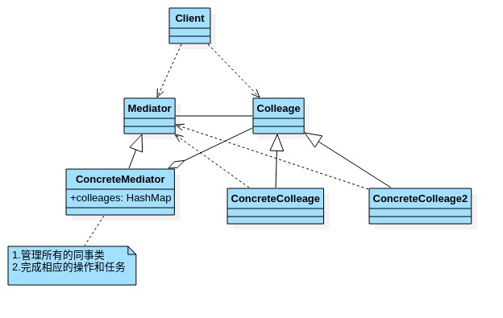
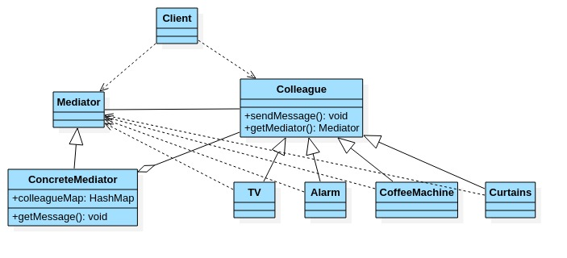

# 中介者模式

- ## 基本介绍

  1. 中介者模式(Mediator pattern),用一个中介对象来封装一系列的对象交互.中介者使各个对象不需要显示地相互引用,从而使其耦合松散,而且可以独立地改变它们之间的交互.
  2. 中介者模式属于行为型模式,使代码易于维护.
  3. 比如MVC模式,C(controller 控制器)是M(Model模型)和V(View视图)的中介者,在前后端交互时起到了中间人的作用.

- ## 原理类图

  

  类图说明:

  1. Mediator:就是抽象中介者,定义了同事对象到中介者对象的接口.
  2. Colleage:抽象同事类.
  3. ConcreteMediator:具体的中介对象,实现抽象方法,它需要知道所有的具体的同事类,即以一个集合来管理HashMap,并接受某个对象消息,完成相应任务.
  4. ConcreteColleage具体的同事类,会有很多,每个同事只知道自己的行为,而不了解其他同事类的行为(方法),但是他们都依赖中介者对象.

- ## 中介者模式完成智能家庭项目

  
  中介者模式-智能家庭的操作流程:

  1. 创建ConcreteMediator对象
  2. 创建各个同事类对象,Alarm,CoffeeMachine,TV..
  3. 在创建同事类对象的时候,就直接通过构造器,加入到colleaguMap.
  4. 同事类对象,可以调用sendMessage,最终会调用ConcreteMediator的getMessage()方法.
  5. getMessage()会根据接受到的同事对象发出的消息来协调调用其他同事对象,完成相应任务.
  6. 可以看到getMessage()是核心方法,完成相应任务.

- ## 代码案例

  ```java
  package com.xie.mediator;
  
  public abstract class Mediator {
      //将同事类对象,加入到集合中
      public abstract void register(String colleagueName, Colleague colleague);
      //接受消息,具体的同事对象发送的消息
      public abstract void getMessage(int stateChange, String colleagueName);
  
      public abstract void sendMessage();
  }
  
  ```

  ```java
  package com.xie.mediator;
  
  import java.util.HashMap;
  import java.util.Map;
  
  //具体的中介者对象
  public class ConcreteMediator extends Mediator {
      private Map<String, Colleague> colleagueMap;
      private Map<String, String> interMap;
  
      public ConcreteMediator() {
          this.colleagueMap = new HashMap<>();
          this.interMap = new HashMap<>();
      }
  
      //注册
      @Override
      public void register(String colleagueName, Colleague colleague) {
          colleagueMap.put(colleagueName, colleague);
  
          if (colleague instanceof Alarm) {
              interMap.put("Alarm", colleagueName);
          } else if (colleague instanceof CoffeeMachine) {
              interMap.put("CoffeeMachine", colleagueName);
          } else if (colleague instanceof TV) {
              interMap.put("TV", colleagueName);
          } else if (colleague instanceof Curtains) {
              interMap.put("Curtains", colleagueName);
          }
      }
  
      //具体中介的核心方法,根据得到的消息,完成任务
      @Override
      public void getMessage(int stateChange, String colleagueName) {
          if (colleagueMap.get(colleagueName) instanceof Alarm) {
              if (stateChange == 0) {
                  ((CoffeeMachine) colleagueMap.get(interMap.get("CoffeeMachine"))).startCoffee();
                  ((TV) colleagueMap.get(interMap.get("TV"))).startTV();
              } else if (stateChange == 1) {
                  ((TV) colleagueMap.get(interMap.get("TV"))).stopTV();
              }
          } else if (colleagueMap.get(colleagueName) instanceof CoffeeMachine) {
              //对各个消息做处理
          } else if (colleagueMap.get(colleagueName) instanceof TV) {
              //对各个消息做处理
          } else if (colleagueMap.get(colleagueName) instanceof Curtains) {
              //对各个消息做处理
          }
      }
  
      @Override
      public void sendMessage() {
  
      }
  }
  
  ```

  ```java
  package com.xie.mediator;
  //同事抽象类
  public abstract class Colleague {
      private Mediator mediator;
      public String name;
  
      public Colleague(Mediator mediator, String name) {
          this.mediator = mediator;
          this.name = name;
      }
  
      public Mediator getMediator() {
          return mediator;
      }
      public abstract void sendMessage(int stateChange);
  }
  
  ```

  ```java
  package com.xie.mediator;
  
  //具体的同事类
  public class Alarm extends Colleague {
      //构造器
      public Alarm(Mediator mediator, String name) {
          super(mediator, name);
          //在创建Alarm同事对象的时候,将自己放入到ConcreteMediator对象中.
          mediator.register(name, this);
      }
  
      public void sendAlarm(int stateChange) {
          sendMessage(stateChange);
      }
  
      @Override
      public void sendMessage(int stateChange) {
          //调用了中介者对象的getMessage
          this.getMediator().getMessage(stateChange, this.name);
      }
  }
  
  ```

  ```java
  package com.xie.mediator;
  
  public class CoffeeMachine extends Colleague {
  
      public CoffeeMachine(Mediator mediator, String name) {
          super(mediator, name);
          mediator.register(name, this);
      }
      public void sendCoffeeMachine(int stateChange){
          sendMessage(stateChange);
      }
  
      @Override
      public void sendMessage(int stateChange) {
          this.getMediator().getMessage(stateChange, this.name);
      }
      public void startCoffee(){
          System.out.println("start coffee...");
      }
  }
  
  ```

  ```java
  package com.xie.mediator;
  
  public class Curtains extends Colleague {
  
      public Curtains(Mediator mediator, String name) {
          super(mediator, name);
          mediator.register(name,this);
      }
  
      public void sendCurtains(int stateChange) {
          sendMessage(stateChange);
      }
  
      @Override
      public void sendMessage(int stateChange) {
          //调用了中介者对象的getMessage
          this.getMediator().getMessage(stateChange, this.name);
      }
  }
  
  ```

  ```java
  package com.xie.mediator;
  
  public class TV extends Colleague {
      public TV(Mediator mediator, String name) {
          super(mediator, name);
          mediator.register(name, this);
      }
  
      public void sendTV(int stateChange){
          sendMessage(stateChange);
      }
  
      @Override
      public void sendMessage(int stateChange) {
          this.getMediator().getMessage(stateChange, this.name);
      }
  
      public void startTV(){
          System.out.println("start TV...");
      }
      public void stopTV(){
          System.out.println("stop TV...");
      }
  }
  
  ```

  ```java
  package com.xie.mediator;
  
  public class Client {
      public static void main(String[] args) {
          //创建一个中介者对象
          Mediator mediator  = new ConcreteMediator();
  
          //创建同事类对象,并且加入到ConcreteMediator 对下对象的hashMap中
          Alarm alarm = new Alarm(mediator,"alarm");
          CoffeeMachine coffeeMachine = new CoffeeMachine(mediator,"coffeeMachine");
          Curtains curtains = new Curtains(mediator,"curtains");
          TV tv = new TV(mediator,"tv");
  
          alarm.sendAlarm(0);
  
      }
  }
  
  ```

- ## 中介者模式注意事项

  1. 多了类相互耦合,会形成网状结构,使用中介者模式将网状结构分离为星型结构,进行解耦.
  2. 减少类之间的依赖,降低了耦合,符合迪米特原则.
  3. 中介者承担了较多的责任,一旦中介者出现了问题,整个系统就会收到影响.
  4. 如果设计不当,中介者对象本身变得过于复杂,这点在实际使用时,要特别注意.
