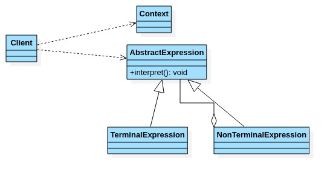
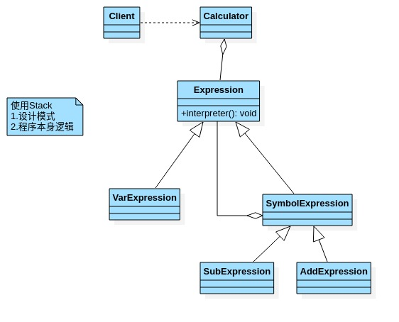

# 解释器模式

- ## 基本介绍

  1. 在编译原理中,一个算术表达式通过**词法分析器**形成词法单元,而后这些词法单元再通过**语法分析器**构建语法树,最终形成一颗抽象的语法分析树.这里的词法分析器和语法分析器都可以看做是解释器.
  2. 解释器模式(Interpreter Pattern):是指给定一个语言(表达式),定义它的文法的一种表示,并定义一个解释器,使用该解释器来解释语言中的句子(表达式)
  3. 应用场景
     - 应用可以将一个需要解释执行的语言中的句子表示为一个抽象语法树.
     - 一些重复出现的问题可以用一种简单的语言来表达.
     - 一个简单语法需要解释的场景.
  4. 这样的例子还有,比如编译器,运算表达式计算,正则表达式,机器人等.

- ## 原理类图

  

  类图说明:

  1. Context:是环境角色,含有解释器之外的全局信息.
  2. AbstractExperssion:抽象表达式,声明一个抽象的解释操作,这个方法为抽象语法树中所有的节点所共享.
  3. TerminalExpression:为终结符表达式,实现与文法中的终结符相关的解释操作.
  4. NonTerminalExpression:为非终结表达式,为文法中的非终结符实现解释操作.
  5. 说明:输入Context和TerminalExpression信息通过Client输入即可.

- ## 解释器模式实现四则运算

  通过解释器模式来实现四则运算,如计算a+b-c的值.

  
  
- ## 运算案例

  ```java
  package com.xie.interpreter;
  
  import java.util.Map;
  
  /**
   * 抽象类表达式,通过map键值对,可以获取到变量的值
   */
  public abstract class Expression {
      /**
       * a+b-c
       * 解释公式和数值,key就是公式(表达式)参数[a,b,c],value就是具体值
       * map{a=10,b=20}
       */
      public abstract int interpreter(Map<String, Integer> var);
  }
  
  ```

  ```java
  package com.xie.interpreter;
  
  import java.util.Map;
  
  /**
   * 变量的解释器
   */
  public class VarExpression extends Expression {
      private String key;//key=a,key=b,key=c
  
      public VarExpression(String key) {
          this.key = key;
      }
  
      /**
       * var {a=10,b=20}
       * interpreter 根据变量的名称,返回对应值
       */
      @Override
      public int interpreter(Map<String, Integer> var) {
          return var.get(key);
      }
  }
  
  ```

  ```java
  package com.xie.interpreter;
  
  import java.util.Map;
  
  /**
   * 抽象运算符解释器 这里,每个运算符号,都只和自己左右两个数字有关系,
   * 但左右两个数字有可能也是一个解析的结果,无论何种类型,都是Expression类的实现类
   */
  public class SymbolExpression extends Expression {
      protected Expression left;
      protected Expression right;
  
      public SymbolExpression(Expression left, Expression right) {
          this.left = left;
          this.right = right;
      }
  
      /**
       * 因为SymbolExpression 是让其子类来实现,因此interpreter 是一个默认实现.
       */
      @Override
      public int interpreter(Map<String, Integer> var) {
          return 0;
      }
  }
  
  ```

  ```java
  package com.xie.interpreter;
  
  import java.util.Map;
  
  /**
   * 加法解释器
   */
  public class AddExpression extends SymbolExpression {
      public AddExpression(Expression left, Expression right) {
          super(left, right);
      }
  
      //处理相加
      //var 仍然是{a=10,b=20}..
      @Override
      public int interpreter(Map<String, Integer> var) {
          //super.left.interpreter(var) : 返回left 表达式对应的值a = 10
          //super.right.interpreter(var) : 返回left 表达式对应的值b = 20
          return super.left.interpreter(var)+super.right.interpreter(var);
      }
  }
  
  ```

  ```java
  package com.xie.interpreter;
  
  import java.util.Map;
  
  //减法解释器
  public class SubExpression extends SymbolExpression {
  
      public SubExpression(Expression left, Expression right) {
          super(left, right);
      }
  
      //求出left和right 表达式相减后的结果.
      @Override
      public int interpreter(Map<String, Integer> var) {
          return super.left.interpreter(var) - super.right.interpreter(var);
      }
  }
  
  ```

  ```java
  package com.xie.interpreter;
  
  import java.util.Map;
  import java.util.Stack;
  
  public class Calculator {
      //定义一个表达式
      private Expression expression;
  
      //构造函数传参
      public Calculator(String expStr) {
          //安排运算先后顺序
          Stack<Expression> stack = new Stack<>();
          //表达式拆分成字符数组
          char[] charArray = expStr.toCharArray();
  
          Expression left = null;
          Expression right = null;
          for (int i = 0; i < charArray.length; i++) {
              switch (charArray[i]) {
                  case '+':
                      left = stack.pop();
                      right = new VarExpression(String.valueOf(charArray[++i]));
                      stack.push(new AddExpression(left, right));
                      break;
                  case '-':
                      left = stack.pop();
                      right = new VarExpression(String.valueOf(charArray[++i]));
                      stack.push(new SubExpression(left, right));
                      break;
                  default:
                      stack.push(new VarExpression(String.valueOf(charArray[i])));
                      break;
              }
          }
          this.expression = stack.pop();
      }
  
      public int run(Map<String, Integer> var) {
          return this.expression.interpreter(var);
      }
  }
  
  ```

  ```java
  package com.xie.interpreter;
  
  import java.io.BufferedReader;
  import java.io.IOException;
  import java.io.InputStreamReader;
  import java.util.HashMap;
  import java.util.Map;
  
  public class Client {
      public static void main(String[] args) throws IOException {
          String expStr = getExpStr();
          Map<String, Integer> value = getValue(expStr);
          Calculator calculator = new Calculator(expStr);
          System.out.println("运算结果:" + expStr + "=" + calculator.run(value));
      }
  
      //获得表达式
      public static String getExpStr() throws IOException {
          System.out.println("请输入表达式");
          return (new BufferedReader(new InputStreamReader(System.in))).readLine();
      }
      //获得值映射
      public static Map<String,Integer> getValue(String expStr) throws IOException {
          Map<String,Integer> map = new HashMap<>();
          char[] chars = expStr.toCharArray();
          for (int i = 0; i < chars.length; i++) {
              if(chars[i] != '+' && chars [i] != '-'){
                  System.out.print("请输入"+chars[i]+"值:");
                  map.put(String.valueOf(chars[i]),Integer.valueOf((new BufferedReader(new InputStreamReader(System.in))).readLine()));
              }
          }
          return map;
      }
  }
  
  ```

- ## 注意事项

  1. 当有一个语言需要解释执行,可将该语言中的句子表示为一个抽象语法树,就可以考虑使用解释器模式,让程序具有良好的扩展性.
  2. 应用场景:编译器,运算表达式计算,正则表达式,机器人等.
  3. 使用解释器可能带来的问题:解释器模式会引起类爆炸,解释器模式采用递归调用方法,将会导致调试非常复杂,效率可能降低.
